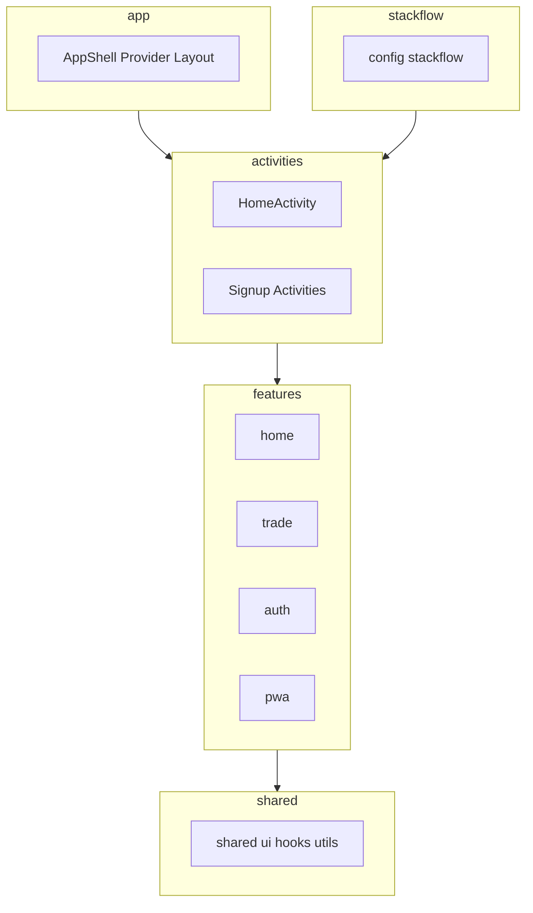
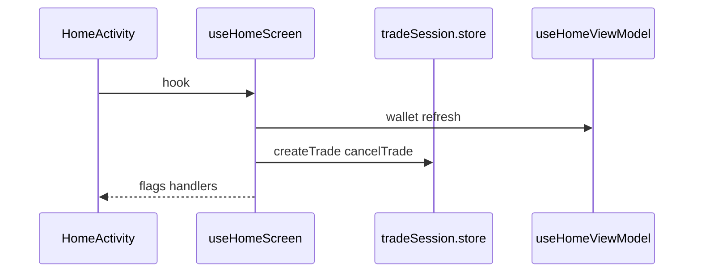

# Architecture Overview

Brit 프론트엔드 아키텍처 요약입니다.

## 레이어



| 레이어 | 경로 | 책임 |
|--------|------|------|
| `app` | `src/app/` | Shell, global layout, Provider, 전역 크롬 |
| `activities` | `src/activities/` | Stackflow Activity — **화면 조립** |
| `features` | `src/features/{domain}/` | 도메인 UI, ViewModel, store, API |
| `shared` | `src/shared/` | cross-feature UI·hook·util |
| `stackflow` | `src/stackflow/` | route, Stack bootstrap |

**import 방향 (권장):** `shared` ← `features` ← `activities` ← `app`

## Feature 내부 구조

```text
features/{domain}/
  components/   # 도메인 전용 UI
  hooks/        # ViewModel, screen hook (useHomeScreen)
  stores/       # client state
  api/          # HTTP/API
  utils/
  mocks/        # dev/mock only
  types.ts
  constants.ts
```

규칙 상세: [docs/conventions/folder-structure.md](../conventions/folder-structure.md)

## 네비게이션

- **Stackflow Activity** — 전체 화면, URL sync
- **BottomSheet / AlertDialog** — Activity 내부 오버레이
- Activity 밖(탭, 배너): `actions` from `stackflow.ts`

상세: [docs/stackflow/README.md](../stackflow/README.md)

## 주요 도메인

| Domain | 경로 | 설명 |
|--------|------|------|
| auth | `features/auth/` | 회원가입, 본인인증, PIN, 세션 |
| home | `features/home/` | 홈 잔액, 거래 입력, PTR |
| trade | `features/trade/` | 매칭, 결제, 분할, trade store |
| merchant | (예정) `features/merchant/` | C2B embed 충전 (Phase 2) |
| pwa | `features/pwa/` | 설치, push (확장) |

도메인 문서:
- [docs/domains/auth.md](../domains/auth.md)
- [docs/domains/trade.md](../domains/trade.md)
- [docs/domains/merchant.md](../domains/merchant.md) — Phase 2 C2B
- [docs/domains/api-spec.md](../domains/api-spec.md) — 백엔드 API req/res·fixture
- [docs/architecture/trade-platform-summary.md](./trade-platform-summary.md) — **거래·플랫폼 종합 (필독)**

## 데이터 흐름 (홈 + 거래 예시)



- Activity → `useHomeScreen` → feature hooks/stores
- UI 컴포넌트는 props/hook 결과만 받음

## 현재 coupling (개선 예정)

| From | To | 내용 |
|------|-----|------|
| `features/trade` | `features/home/stores/homeWallet.store` | 거래 완료 시 잔액 반영 |

향후 `features/wallet/` 또는 이벤트/API 경계로 분리 검토.  
당장은 문서화만 하고 동작 유지.

## 디자인·UX·PWA

| 영역 | 참고 |
|------|------|
| SEED Design | `.cursor/rules/seed-design.mdc`, `seed-design/` snippets |
| Consumer UX | `.cursor/rules/consumer-ux.mdc` |
| PWA | `.cursor/rules/pwa.mdc`, `docs/pwa/` |

## ADR

- [001-stackflow-navigation.md](../adr/001-stackflow-navigation.md) — Stackflow 선택 이유

## 신규 기능 추가 체크리스트

1. domain 폴더(`features/`)에 로직 배치
2. Activity는 `useXxxScreen`으로 얇게
3. `config.ts` Register + route
4. Consumer UX / reduced-motion
5. `docs/domains/*` 또는 stackflow 화면 맵 갱신
