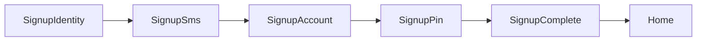

# Auth Domain

회원가입·본인인증·PIN·세션 도메인 요약입니다.

**API 스펙:** [docs/domains/api-spec.md](./api-spec.md) §3 Auth API  
**Fixture:** [docs/fixtures/auth/](../fixtures/auth/)

## 코드 위치

| 역할 | 경로 |
|------|------|
| 상수·스텝 | `src/features/auth/constants.ts` |
| 가입 draft | `src/features/auth/stores/signupDraft.store.ts` |
| 세션 | `src/features/auth/stores/authSession.store.ts` |
| API facade | `src/features/auth/api/auth.api.ts`, `banks.api.ts` |
| API adapters | `src/features/auth/api/adapters/` (supabase / http / mock) |
| mappers | `src/features/auth/mappers/` |
| UI | `src/features/auth/components/` |
| Activity | `src/activities/auth/` |

## API 레이어

Nest 이전을 대비해 hook/UI는 facade만 호출합니다. 인프라는 adapter로 교체합니다.

| 레이어 | 책임 | 예 |
|--------|------|-----|
| facade | 도메인 함수 시그니처·어댑터 선택 | `fetchActiveBanks`, `sendSmsCode` |
| adapters | Supabase / HTTP / mock 구현 | `banks.supabase.ts`, `auth.mock.ts` |
| mappers | DTO/row → 앱 타입 | `bank.mapper.ts` → `Institution` |

- `VITE_API_BASE_URL`이 있으면 HTTP adapter, 없으면 banks는 Supabase·auth는 mock
- shared HTTP: `src/shared/api/httpClient.ts`, 에러: `src/shared/api/errors.ts`

## 가입 Activity 체인



| Activity | Route | Params | 설명 |
|----------|-------|--------|------|
| `SignupIdentity` | `/auth/signup/identity` | — | 이름·주민번호·통신사·휴대폰 (progressive form) |
| `SignupSms` | `/auth/signup/sms` | `phone` | OCTOMO 기기인증 안내 (모바일 CTA / 데스크톱 QR) |
| `SignupAccount` | `/auth/signup/account` | `step?`: `bank` \| `accountNumber` | 금융기관·계좌 |
| `SignupPin` | `/auth/signup/pin` | `step?`: `create` \| `confirm` | PIN 설정·확인 |
| `SignupComplete` | `/auth/signup/complete` | — | 완료 → Home `replace` |

### OCTOMO 기기인증 (`SignupSms`)

상태 모델 (모바일·데스크톱 공통):

```text
READY → WAITING/CHECKING → VERIFIED → (0.8s) replace SignupAccount
                 ↘ DELAYED (폴링 소진) → 수동 1회 확인
                 ↘ ERROR (API 실패 안내, 폴링은 계속 가능)
```

- **기본 방법**: 데스크톱 추천 → `qr`, 그 외 → `sms`. 사용자가 `문자 앱`/`QR`로 전환 가능 (PWA 설치 여부로 분기하지 않음)
- **SMS**: CTA `문자 앱 열기` → 방식 A (`sms:?body=`) → **복귀 후**에만 적응형 폴링 `[2s,4s,8s,15s,30s]`
- **QR**: Edge `POST octomo`로 QR 발급(`text` = SMS URI 전체). 실패 시 `qrcode.react` fallback. 표시 후 폴링 `[10s,15s,25s,40s]`
- **exists**: `GET octomo?mobileNum=&text=&withinMinutes=` → `{ exists }`. `false`는 대기(WAITING), 오류 UI 금지
- pending: `sessionStorage` (`brit:pending-octomo`, phone/message/startedAt, 10분 만료)
- `exists: true` → VERIFIED → 800ms 후 `replace` SignupAccount (bank). AccountIntroSheet 생략
- DELAYED: `다시 확인하기`(1회), SMS면 `문자 앱 다시 열기`, `번호 수정하기`→`pop()`
- 폴링 유틸: `src/features/auth/utils/startOctomoPolling.ts` (hidden 시 스킵, visible 복귀 1.5s)
- API facade: `features/auth/api/octomo.api.ts` → `createOctomoQr` / `checkOctomoMessage`
- Edge 소스: `supabase/functions/octomo/index.ts`
- URI 유틸: `src/features/auth/utils/createOctomoSmsUrl.ts`
- 기기 힌트: `DeviceContextProvider` (UX/DEV용, OCTOMO 키·PII 없음)
- `OCTOMO_API_KEY`는 Supabase Secrets만 (프론트 `VITE_` 금지)

## Identity progressive form

내부 스텝 (`SignupIdentityStep`): `name` → `rrn` → `carrier` → `phone`

- UI: `SignupProgressiveForm` + `ActiveStepInput`
- CTA: form submit (`SIGNUP_IDENTITY_FORM_ID`)
- RRN: `SplitRrnFirst7Field` (생년월일 6 + 성별 1)
- Progress 헤더: `SignupProgressHeader`

## PIN flow

- `create` 4자리 입력 완료 → draft 저장 → `replace('SignupPin', { step: 'confirm' })`
- confirm 불일치 → snackbar + 재입력
- confirm 일치 → `registerPin` → `SignupComplete`
- 뒤로: confirm → `replace` create (pop 대신 히스토리 정리)

Hook: `src/features/auth/hooks/useSignupPinFlow.ts`

## Progress bar

`SignupProgressHeader` — Activity별 `type` + `step`:

- `identity` / `account` / `pin` / `sms`
- `ActivityScreenLayout`의 `progress` prop으로 주입

## 인증 가드

- `useRequireAuth(reason)` — 거래 등 인증 필요 액션
- `useAuthRequiredPrompt` — 탭(거래내역·프로필)에서 가입 유도
- `AuthRequiredAlertDialog` — dismiss **`닫기`**

## Stack 밖 네비게이션

- 탭에서 가입: `actions.push('SignupIdentity', {})` ([GlobalBottomNavigation](../../src/app/layouts/GlobalBottomNavigation.tsx))
- 가입 완료: `actions.pop` + `actions.replace('Home')` ([SignupCompleteActivity](../../src/activities/auth/SignupCompleteActivity.tsx))

## Consumer UX

- 가입 이탈: `SignupExitAlertDialog` (명시적 뒤로가기에서만)
- 카피 해요체 (`constants.ts` IDENTITY_STEP_COPY)
- AlertDialog 왼쪽: `닫기`

## 관련 문서

- [docs/stackflow/README.md](../stackflow/README.md)
- [CONTRIBUTING.md](../../CONTRIBUTING.md) — Consumer UX 체크리스트
