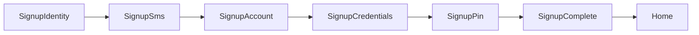

# Auth Domain

회원가입·본인인증·로그인(패스키/비밀번호)·거래 PIN·세션 도메인 요약입니다.

## 인증 계층 (섞지 않음)

| 구분 | 용도 | 저장 |
|------|------|------|
| 패스키 | 기본 로그인 | Supabase Auth |
| 로그인 비밀번호 | 패스키 불가 환경 보조 | Supabase Auth |
| 휴대폰 | Auth 식별자 | `auth.users.phone` (E.164) + `user_profiles.phone_number` |
| 거래 PIN | 거래·환전·계좌 변경 | `user_profiles.transaction_pin_hash` (서버 bcrypt) |
| 닉네임 | 거래 공개 이름 | `user_profiles.nickname` (가입 시 입력, 로그인 ID 아님) |

## 시작 파일

| 작업 | Activity | Hook | API / 유틸 |
|------|----------|------|------------|
| 본인확인 | `SignupIdentityActivity` | `useSignupIdentityScreen` | draft store |
| OCTOMO | `SignupSmsActivity` | `useSignupOctomoVerify` | `octomo.api`, `startOctomoPolling` |
| 계좌 | `SignupAccountActivity` | `useSignupAccountScreen` | `banks.api` |
| 닉네임·로그인 비번 | `SignupCredentialsActivity` | `useSignupCredentialsFlow` | draft + secrets (제출 없음) |
| 거래 PIN·최종 가입 | `SignupPinActivity` | `useSignupPinFlow` | `completeSignup` |
| 완료 | `SignupCompleteActivity` | (Activity 내) | session · 패스키 설정 유도 |
| 로그인 | `LoginActivity` | `useLoginScreen` | passkey / password |
| 보안 설정 | `SecuritySettingsActivity` | `useSecuritySettingsScreen` | passkey list/관리 |
| 계정 복구 | `AccountRecoveryActivity` | `useAccountRecoveryScreen` | recovery API |

화면 순서: [docs/stackflow/README.md](../stackflow/README.md) 「화면 지도」

**API 스펙:** [docs/domains/api-spec.md](./api-spec.md) §3 Auth API  
**Fixture:** [docs/fixtures/auth/](../fixtures/auth/)  
**스키마:** [supabase/migrations/20260723_user_profiles_auth_p0.sql](../../supabase/migrations/20260723_user_profiles_auth_p0.sql)

## 코드 위치

| 역할 | 경로 |
|------|------|
| 상수·스텝 | `src/features/auth/constants.ts` |
| 가입 draft | `src/features/auth/stores/signupDraft.store.ts` |
| 가입 secrets | `src/features/auth/stores/signupSecrets.store.ts` (loginPassword·transactionPin, 메모리만) |
| 세션 | `src/features/auth/stores/authSession.store.ts` |
| API facade | `src/features/auth/api/auth.api.ts`, `banks.api.ts` |
| API adapters | `src/features/auth/api/adapters/` (supabase / http / mock) |
| phone 정규화 | `src/features/auth/utils/phoneE164.ts` (표시용). **DB/Auth 변환은 서버 한곳** |
| Edge | `supabase/functions/signup/`, `supabase/functions/octomo/` |
| UI | `src/features/auth/components/` |
| Activity | `src/activities/auth/` |

## API 레이어

Nest 이전을 대비해 hook/UI는 facade만 호출합니다. 인프라는 adapter로 교체합니다.

| 레이어 | 책임 | 예 |
|--------|------|-----|
| facade | 도메인 함수 시그니처·어댑터 선택 | `completeSignup`, `fetchActiveBanks` |
| adapters | Supabase / HTTP / mock 구현 | `auth.supabase.ts`, `auth.mock.ts` |
| mappers | DTO/row → 앱 타입 | `bank.mapper.ts` → `Institution` |

- `VITE_API_BASE_URL`이 있으면 HTTP adapter 우선
- 없으면 banks는 Supabase, auth 가입/로그인은 Supabase Edge·Auth (불가 시 mock)
- shared HTTP: `src/shared/api/httpClient.ts`, 에러: `src/shared/api/errors.ts`

## Phone 정규화

| 위치 | 형식 |
|------|------|
| 가입 draft / UI | `01012345678` (숫자만) |
| `auth.users.phone` / signup Edge | E.164 `+821012345678` |
| `user_profiles.phone_number` | Edge가 Auth와 **동일 E.164**로 저장 |

변환은 **signup Edge Function 한곳**에서만 수행합니다. 프론트는 draft를 숫자로 유지합니다.

## 가입 Activity 체인



| Activity | Route | Params | 설명 |
|----------|-------|--------|------|
| `SignupIdentity` | `/auth/signup/identity` | — | 이름·주민번호·통신사·휴대폰 |
| `SignupSms` | `/auth/signup/sms` | `phone` | OCTOMO 기기인증 |
| `SignupAccount` | `/auth/signup/account` | `step?`: `bank` \| `accountNumber` | 금융기관·계좌 |
| `SignupCredentials` | `/auth/signup/credentials` | `step?`: `nickname` \| `password` | 닉네임·로그인 비번 (제출 없음) |
| `SignupPin` | `/auth/signup/pin` | `step?`: `create` \| `confirm` | 거래 PIN + **최종 completeSignup** |
| `SignupComplete` | `/auth/signup/complete` | — | 완료 · 패스키는 설정 유도 |
| `Login` | `/auth/login` | `mode?`: `passkey` \| `password` | 패스키 우선 / 휴대폰+비번 |
| `SecuritySettings` | `/auth/security` | — | 패스키·세션 관리 |
| `AccountRecovery` | `/auth/recovery` | `step?` | 복구 |

### SignupCredentials 내부

```text
nickname → password
```

- `nickname`: debounce 선검사 → draft 저장 → password
- `password`: secrets에 loginPassword 저장 → `push SignupPin`
- 회원 생성하지 않음

### PIN flow (거래 PIN + 최종 제출)

- `create` 4자리 → secrets.transactionPin → `replace confirm`
- confirm 일치 → `completeSignup` → `signInAfterPassword` → `replace SignupComplete`
- 뒤로: confirm → create / create → Credentials password

최종 제출 시점은 **Pin confirm**입니다.

### OCTOMO 기기인증 (`SignupSms`)

상태 모델 (모바일·데스크톱 공통):

```text
READY → WAITING/CHECKING → VERIFIED → (0.8s) replace SignupAccount
                 ↘ DELAYED (폴링 소진) → 수동 1회 확인
                 ↘ ERROR (API 실패 안내, 폴링은 계속 가능)
```

- **기본 방법**: 데스크톱 추천 → `qr`, 그 외 → `sms`. 사용자가 `문자 앱`/`QR`로 전환 가능 (PWA 설치 여부로 분기하지 않음)
- **SMS**: CTA `문자 앱 열기` → 방식 A (`sms:?body=`) → **복귀 후**에만 적응형 폴링 `[2s,4s,8s,15s,30s]`
- **QR**: Edge `POST octomo`로 QR 발급(`text` = SMS URI 전체). 실패 시 `qrcode.react` fallback. 표시 후 폴링 `[10s,15s,25s,40s]`
- **exists**: `GET octomo?mobileNum=&text=&withinMinutes=` → `{ exists }`. `false`는 대기(WAITING), 오류 UI 금지
- pending: `sessionStorage` (`brit:pending-octomo`, phone/message/startedAt, 10분 만료)
- `exists: true` → VERIFIED → 800ms 후 `replace` SignupAccount (bank)
- DELAYED: `다시 확인하기`(1회), SMS면 `문자 앱 다시 열기`, `번호 수정하기`→`pop()`
- 폴링 유틸: `src/features/auth/utils/startOctomoPolling.ts` (hidden 시 스킵, visible 복귀 1.5s)
- API facade: `features/auth/api/octomo.api.ts` → `createOctomoQr` / `checkOctomoMessage`
- Edge 소스: `supabase/functions/octomo/index.ts`
- URI 유틸: `src/features/auth/utils/createOctomoSmsUrl.ts`
- 기기 힌트: `DeviceContextProvider` (UX/DEV용, OCTOMO 키·PII 없음)
- `OCTOMO_API_KEY`는 Supabase Secrets만 (프론트 `VITE_` 금지)

## Identity progressive form

내부 스텝 (`SignupIdentityStep`): `name` → `rrn` → `carrier` → `phone`

- UI: `SignupProgressiveForm` + `ActiveStepInput`
- CTA: form submit (`SIGNUP_IDENTITY_FORM_ID`)
- RRN: `SplitRrnFirst7Field` (생년월일 6 + 성별 1)
- Progress 헤더: `SignupProgressHeader`

## PIN flow (거래 PIN)

- `create` 4자리 → secrets 저장 → `replace('SignupPin', { step: 'confirm' })`
- confirm 불일치 → snackbar + 재입력
- confirm 일치 → `completeSignup` → 세션 → `SignupComplete`
- 뒤로: confirm → `replace` create

Hook: `src/features/auth/hooks/useSignupPinFlow.ts`

## Progress bar

`SignupProgressHeader` — Activity별 `type` + `step`:

- `identity` / `sms` / `account` / `credentials` / `pin`
- 총 11스텝 (Credentials 후 Pin이 마지막)

## 로그인

- 첫 화면: **패스키로 로그인** CTA → 보조로 휴대폰+비밀번호
- `signInWithPasskey()` / `signInWithPassword({ phone: E.164, password })`
- Supabase client: `auth.experimental.passkey: true`

## 계정 복구 (P1)

OCTOMO만으로 비밀번호를 즉시 재설정하지 않습니다. 최소 2요소:

```text
OCTOMO + (계좌 예금주 확인 | 이름·생년월일 | 기존 기기 승인 | 복구 이메일)
```

복구 후 `sensitive_actions_locked_until` 동안 계좌 변경·고액 거래·출금·거래 PIN 변경을 막습니다.

## 인증 가드

- `useRequireAuth(reason)` — 거래 등 인증 필요 액션
- `useAuthRequiredPrompt` — 탭에서 로그인 유도
- `AuthRequiredAlertDialog` — **`닫기` / `로그인`만** (가입은 Login에서)
- `assertSensitiveActionAllowed` — 복구 쿨다운 검사

가입 진입: Login → `아직 계정이 없어요` → `SignupIdentity`

## Stack 밖 네비게이션

- 탭·가드에서 미인증: `actions.push('Login', {})` ([GlobalBottomNavigation](../../src/app/layouts/GlobalBottomNavigation.tsx))
- 가입: Login → `아직 계정이 없어요` → `SignupIdentity`
- 가입 완료: `actions.pop` + `actions.replace('Home')` ([SignupCompleteActivity](../../src/activities/auth/SignupCompleteActivity.tsx))

## Consumer UX

- 가입 이탈: `SignupExitAlertDialog` (명시적 뒤로가기에서만)
- 카피 해요체 (`constants.ts`)
- AlertDialog 왼쪽: `닫기`
- 패스키 skip: **나중에 설정하기**

## 관련 문서

- [docs/stackflow/README.md](../stackflow/README.md)
- [CONTRIBUTING.md](../../CONTRIBUTING.md) — Consumer UX 체크리스트
