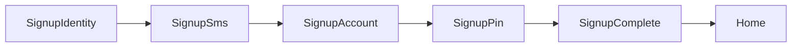

# Auth Domain

회원가입·본인인증·PIN·세션 도메인 요약입니다.

**API 스펙:** [docs/domains/api-spec.md](./api-spec.md) §3 Auth API  
**Fixture:** [docs/fixtures/auth/](../fixtures/auth/)

## 코드 위치

| 역할 | 경로 |
|------|------|
| 상수·스텝 | `src/features/auth/constants.ts` |
| 가입 draft | `src/features/auth/stores/signupDraft.store.ts` |
| 세션 | `src/features/auth/stores/authSession.store.ts` |
| API | `src/features/auth/api/auth.api.ts` |
| UI | `src/features/auth/components/` |
| Activity | `src/activities/auth/` |

## 가입 Activity 체인

| Activity | Route | Params | 설명 |
|----------|-------|--------|------|
| `SignupIdentity` | `/auth/signup/identity` | — | 이름·주민번호·통신사·휴대폰 (progressive form) |
| `SignupSms` | `/auth/signup/sms` | `phone` | SMS 인증번호 |
| `SignupAccount` | `/auth/signup/account` | `step?`: `bank` \| `accountNumber` | 금융기관·계좌 |
| `SignupPin` | `/auth/signup/pin` | `step?`: `create` \| `confirm` | PIN 설정·확인 |
| `SignupComplete` | `/auth/signup/complete` | — | 완료 → Home `replace` |

## Identity progressive form

내부 스텝 (`SignupIdentityStep`): `name` → `rrn` → `carrier` → `phone`

- UI: `SignupProgressiveForm` + `ActiveStepInput`
- CTA: form submit (`SIGNUP_IDENTITY_FORM_ID`)
- RRN: `SplitRrnFirst7Field` (생년월일 6 + 성별 1)
- Progress 헤더: `SignupProgressHeader`

## PIN flow

- `create` 4자리 입력 완료 → draft 저장 → `replace('SignupPin', { step: 'confirm' })`
- confirm 불일치 → snackbar + 재입력
- confirm 일치 → `registerPin` → `SignupComplete`
- 뒤로: confirm → `replace` create (pop 대신 히스토리 정리)

Hook: `src/features/auth/hooks/useSignupPinFlow.ts`

## Progress bar

`SignupProgressHeader` — Activity별 `type` + `step`:

- `identity` / `account` / `pin` / `sms`
- `ActivityScreenLayout`의 `progress` prop으로 주입

## 인증 가드

- `useRequireAuth(reason)` — 거래 등 인증 필요 액션
- `useAuthRequiredPrompt` — 탭(거래내역·프로필)에서 가입 유도
- `AuthRequiredAlertDialog` — dismiss **`닫기`**

## Stack 밖 네비게이션

- 탭에서 가입: `actions.push('SignupIdentity', {})` ([GlobalBottomNavigation](../../src/app/layouts/GlobalBottomNavigation.tsx))
- 가입 완료: `actions.pop` + `actions.replace('Home')` ([SignupCompleteActivity](../../src/activities/auth/SignupCompleteActivity.tsx))

## Consumer UX

- 가입 이탈: `SignupExitAlertDialog` (명시적 뒤로가기에서만)
- 카피 해요체 (`constants.ts` IDENTITY_STEP_COPY)
- AlertDialog 왼쪽: `닫기`

## 관련 문서

- [docs/stackflow/README.md](../stackflow/README.md)
- [CONTRIBUTING.md](../../CONTRIBUTING.md) — Consumer UX 체크리스트
