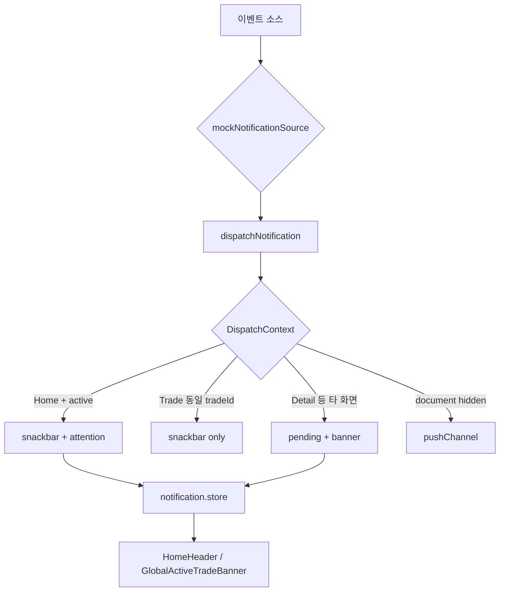

# 알림 · 실시간 이벤트

Brit P2P 거래 미니앱의 **클라이언트 알림 아키텍처**와 MVP 이벤트 목록입니다.  
서버 스펙은 [trade-api.md §4.6](../porcess/trade-api.md)을 기준으로 하며, 클라이언트 구현은 `src/features/notifications/`에 있습니다.

---

## 1. 이벤트 카탈로그 (MVP)

| 이벤트 | 수신 | 우선순위 | 채널 (기본) | 설명 |
|--------|------|----------|-------------|------|
| `MATCHING_SUGGESTION` | 본인 | high | attention, snackbar (Home) / pending, banner (타 화면) | 매칭 후보 제안 — EXACT·NEAR_TIMEOUT |
| `PROPOSAL_RECEIVED` | 상대 | high | push, banner | 상대가 매칭 제안을 보냄 |
| `TRADE_BOUND` | 양쪽 | high | snackbar, attention (Home) / push, banner | Binding 완료 → `PAYMENT_PENDING` |
| `PAYMENT_REPORTED` | 판매자 | high | push, snackbar, banner | 구매자 「보냈어요」 |
| `PAYMENT_REPORTED_ACK` | 구매자 | normal | snackbar, attention | 입금 신고 접수 — 판매자 확인 대기 |
| `TRADE_COMPLETED` | 양쪽 | normal | snackbar, push | leg·단건 완료 |
| `TRADE_EXPIRED` | 양쪽 | high | push, banner | 입금·확인 기한 초과 |
| `DISPUTE_OPENED` | 양쪽 | high | push, banner | `DISPUTED` 진입 |
| `DISPUTE_RESOLVED` | 양쪽 | normal | push, banner | CS resolve |

### 페이로드 공통 필드

```ts
{
  id: string
  type: NotificationEventType
  tradeId?: string
  splitGroupId?: string
  focusLeg?: number
  amountKrw?: number
  message: string        // 해요체 UI 카피
  title?: string
  priority: 'low' | 'normal' | 'high'
  createdAt: string
}
```

---

## 2. 채널 레이어

| 채널 | 용도 | 구현 |
|------|------|------|
| **snackbar** | 포그라운드·맥락 있는 짧은 피드백 | SEED Snackbar (`showSnackbar`) |
| **attention** | 홈 활성 거래 카드 강조 (pulse) | `notification.store` → `HomeHeader` |
| **banner** | Stack 밖 타 화면 (Detail 등) | `GlobalActiveTradeBanner` + pending |
| **pending** | 미소비 큐 — 재진입 시 소비 | `notification.store` queue |
| **push** | 백그라운드·앱 종료 | `pushChannel` → `pushNotificationService` |

**Consumer UX 원칙**

- 진입 직후 전면 시트/권한 요청 없음
- dismiss 라벨 `닫기`
- 화면당 핵심 모션 1곳 (거래 독/패널)

---

## 3. 클라이언트 아키텍처

```text
src/features/notifications/
  types.ts                    # 이벤트·채널·DispatchContext
  notification.store.ts       # pending 큐, attention 상태
  dispatchNotification.ts     # 맥락별 채널 라우팅
  adapters/
    mockNotificationSource.ts # trade/matching store 구독 (MVP)
    pushChannel.ts            # 브라우저 push 래퍼
  hooks/
    useNotifications.ts
    useNotificationBootstrap.ts
    useHomeNotificationAttention.ts
```

### NotificationDispatcher 흐름



**DispatchContext** 필드:

- `currentActivity` — Stackflow activity name
- `pathname` — URL (bottom nav·배너 표시)
- `tradeId` / `splitGroupId` — 현재 포커스 거래
- `isActivityActive` — Activity `isActive`
- `isDocumentVisible` — `document.visibilityState`

---

## 4. UI/UX 파이프라인

### 4.1 매칭 제안 (`MATCHING_SUGGESTION`)

1. `matchingSession.store` → `setSuggestion`
2. mock 소스가 이벤트 emit
3. **Home**: 스낵바 + 헤더 카드 attention + 카피 변경
4. 카드 탭 → `Trade` push → 매칭 시트 자동 오픈 → `MatchingAcceptBottomSheet`
5. **타 화면**: pending 큐 + `GlobalActiveTradeBanner` 메시지

### 4.2 매칭 완료 (`TRADE_BOUND`)

1. `completeMatching` → `PAYMENT_PENDING`
2. Home/Trade 스낵바, 구매자는 입금 시트 자동 오픈 (Trade 정책 C)
3. push 권한 ready 시 브라우저 알림

### 4.3 입금 신고 (`PAYMENT_REPORTED` / `PAYMENT_REPORTED_ACK`)

| 역할 | 이벤트 | UI |
|------|--------|-----|
| 구매자 | `PAYMENT_REPORTED_ACK` | 시트 유지 · `판매자가 입금을 확인하고 있어요` + moneybag APNG |
| 판매자 | `PAYMENT_REPORTED` | push + 입금 확인 시트 |

### 4.4 완료·분쟁

- `TRADE_COMPLETED` → 스낵바 + 잔액 갱신 (Home)
- `DISPUTE_OPENED` → 분쟁 모션 (`money-protect.v1.apng`) + 배너

---

## 5. 모션 에셋 매핑

| 거래 UI 상태 | 역할 | 에셋 | 경로 |
|--------------|------|------|------|
| `MATCHING` (탐색) | 공통 | moneybag rotate | `/motion/moneybag-rotate.v1.apng` |
| `MATCHING` (승인 대기) | 공통 | moneybag loop | `/motion/moneybag-loop.v1.apng` |
| `PAYMENT_PENDING` | 판매자 | flying coin | `/motion/flying-coin-won.v1.apng` |
| `PAYMENT_REPORTED` | 구매자 | money winds | `src/assets/lottie/money-winds-loop.v1.json` |
| `COMPLETED` | 공통 | Success lottie | `src/assets/lottie/success.v1.json` |
| `DISPUTED` | 공통 | money protect | `/motion/money-protect.v1.apng` |

정의: `src/features/trade/constants/motionAssets.ts`

---

## 6. Mock → SSE/WebSocket 마이그레이션

### 현재 (MVP mock)

- `mockNotificationSource`가 `tradeSession.store`·`matchingSession.store` 구독
- 상태 전이 시 클라이언트가 이벤트 합성

### 목표 (실서버)

1. **`NotificationSource` 인터페이스** 도입 (mock / SSE / WebSocket 구현체 교체)
2. `GET /me/trades/active` 응답 `pendingNotifications[]` → 앱 기동·foreground 시 `enqueuePending` + `dispatchNotification`
3. SSE `events:user:{userId}` 또는 WebSocket — 이벤트 수신 시 동일 `dispatchNotification` 호출
4. `mockNotificationSource` 제거, trade store는 **상태만** 반영 (알림 합성 X)
5. push는 서버 → SW; `pushChannel`은 클릭 딥링크만 유지

```text
[서버 이벤트] → adapter (sse | ws) → dispatchNotification(context) → channels
                     ↑
              pendingNotifications (REST sync)
```

### 교체 체크리스트

- [ ] `NotificationSource.connect(userId)` / `disconnect()`
- [ ] 이벤트 id 멱등 (중복 스낵바 방지)
- [ ] Trade 화면 동일 tradeId 시 배너 생략 규칙 유지
- [ ] `focusLeg` deep link → `useTradeScreen` 시트 오픈

---

## 7. 관련 문서

- [trade-api.md §4.6](../porcess/trade-api.md) — 서버 이벤트·pendingNotifications
- [trade-payment-ux.md](../porcess/trade-payment-ux.md) — 입금·확인 UX
- `.cursor/rules/consumer-ux.mdc` — 해요체·인터럽트 금지
- `.cursor/rules/pwa.mdc` — push·SW
