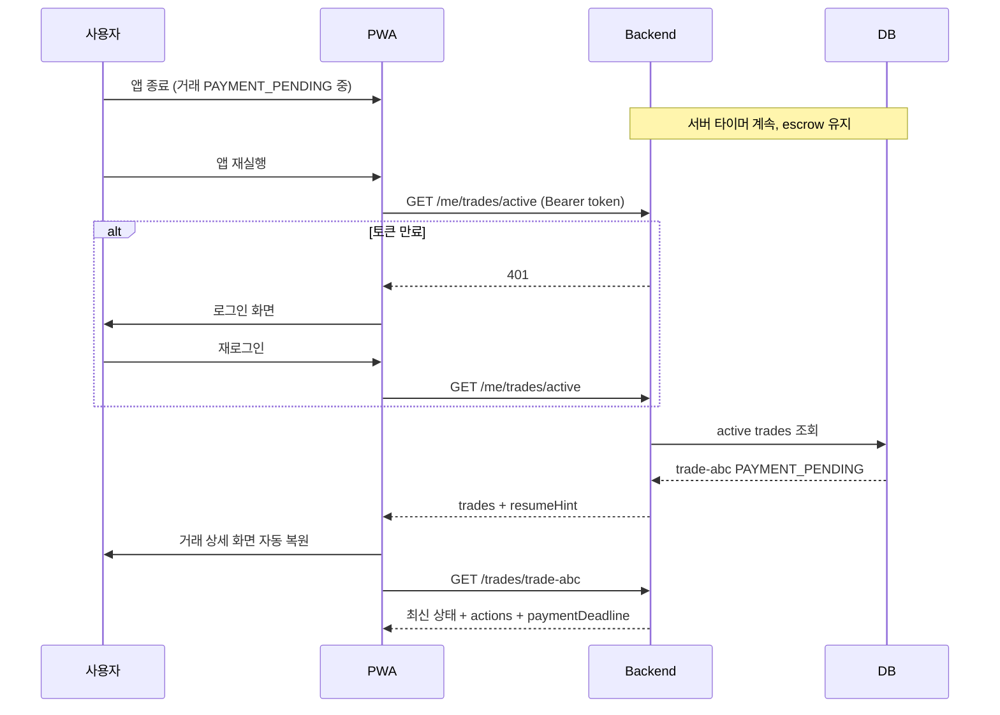

# Brit 거래 API 프로세스

이 문서는 **Brit** 거래 백엔드 API의 설계 원칙·엔드포인트·상태 전이·이상 방지 규칙을 정의합니다.  
거래 중 세션 종료·앱(PWA) 종료 후에도 **서버가 단일 진실(Single Source of Truth)** 을 유지하고, 재진입 시 동일 거래를 복원하는 것을 최우선 목표로 합니다.

**버전**: Draft v0.1  
**관련 문서**: [trade-process.md](./trade-process.md)

---

## 1. 설계 원칙

| 원칙 | 설명 |
|------|------|
| **서버 주도 상태** | 거래 상태는 DB에만 존재. 클라이언트는 캐시·UI일 뿐 |
| **세션 ≠ 거래** | JWT/세션 만료 ≠ 거래 취소. 재로그인 후 같은 거래로 복귀 |
| **멱등성(Idempotency)** | 입금 신고·확인·취소는 중복 요청해도 결과 동일 |
| **낙관적 잠금** | `version` 필드로 동시 수정(양쪽이 동시에 확인 등) 방지 |
| **서버 타이머** | 입금 기한·매칭 만료는 클라이언트 clock이 아닌 서버 기준 |
| **원자적 정산** | 코인 이동은 DB 트랜잭션 + 원장(Ledger) 기록 |
| **복구 우선 API** | 앱 재진입 시 `active trades` 조회가 가장 먼저 호출 |

> **중요**: "세션이 종료되어도 거래가 안 끊긴다"는 **인증 토큰 없이도 거래가 진행된다**는 뜻이 아닙니다.  
> 거래 **엔티티·타이머·에스크로**는 서버에서 계속 돌고, 사용자는 **재인증 후** 이어서 행동합니다.

---

## 2. 엔티티 계층

```
TradeOrder     매칭 대기 주문 (OPEN)
     │
     ▼ 매칭
Trade            1:1 거래 단위 (상태 머신) ← API의 핵심
     │
SplitGroup       분할 판매 묶음 (선택)
     └── Trade[]  N개의 독립 Trade
```

### TradeOrder vs Trade

| 엔티티 | 역할 |
|--------|------|
| `TradeOrder` | "100만원 판매 등록" 같은 **의사** |
| `Trade` | 매칭된 **실제 거래**. 지속성·타이머·에스크로는 Trade 단위 |

### 분할 판매 구조

```
SplitGroup (id, sellerId, totalAmountKrw, totalCoinAmount, status)
  ├── Trade #1  (500,000원)  → MATCHING → ... → COMPLETED
  ├── Trade #2  (500,000원)  → PAYMENT_PENDING
  └── Trade #3  (500,000원)  → OPEN (아직 미매칭)
```

- 자식 Trade는 **각각 독립 상태 머신**
- UI는 `SplitGroup` 요약 + 개별 Trade 목록을 함께 받음
- 앱 재진입 시 **그룹 ID 하나**로 전체 진행률 복원

---

## 3. 거래 상태 머신 (서버 강제)

프론트 타입 (`src/features/home/types.ts`)과 동일:

```typescript
export type TradeStatus =
  | 'MATCHING'
  | 'PAYMENT_PENDING'
  | 'PAYMENT_REPORTED'
  | 'COMPLETED'
  | 'CANCELLED'
  | 'EXPIRED'
```

```
MATCHING → PAYMENT_PENDING → PAYMENT_REPORTED → COMPLETED
    │              │                  │
    └──────────────┴──────────────────┴──→ CANCELLED / EXPIRED
```

### 허용 전이 (서버에서만 변경)

| From | To | 트리거 | 액터 |
|------|-----|--------|------|
| — | MATCHING | 주문 매칭 성공 | 시스템 |
| MATCHING | PAYMENT_PENDING | 매칭 확정 + 계좌 노출 | 시스템 |
| MATCHING | CANCELLED | 사용자 취소 / 매칭 실패 | 사용자·시스템 |
| MATCHING | EXPIRED | 매칭 타임아웃 | 시스템(크론) |
| PAYMENT_PENDING | PAYMENT_REPORTED | 입금 신고 | 구매자 |
| PAYMENT_PENDING | CANCELLED | 취소(정책) | 사용자 |
| PAYMENT_PENDING | EXPIRED | 입금 기한 초과 | 시스템(크론) |
| PAYMENT_REPORTED | COMPLETED | 입금 확인 | 판매자 |
| PAYMENT_REPORTED | PAYMENT_PENDING | 미수신 신고(정책) | 판매자 |
| PAYMENT_REPORTED | COMPLETED | 자동 확인(정책·향후) | 시스템 |

### 이상 방지 규칙

- 잘못된 전이 → `409 Conflict` + 현재 상태 반환 (클라이언트 동기화)
- `COMPLETED` / `CANCELLED` / `EXPIRED` → **모든 변경 API 거부** (terminal)
- 상태 변경 시 `version` +1, `updatedAt` 갱신

---

## 4. API 엔드포인트

### 4.1 복구·진입 (가장 중요)

앱/PWA 재진입, 탭 복귀, cold start 시 **항상 서버부터** 조회합니다.

#### `GET /v1/me/trades/active`

**응답 예시**

```json
{
  "trades": [
    {
      "id": "trade-abc",
      "role": "BUYER",
      "status": "PAYMENT_PENDING",
      "amountKrw": 100000,
      "coinAmount": 100,
      "version": 3,
      "paymentDeadline": "2026-07-07T10:45:00+09:00",
      "splitGroupId": null,
      "updatedAt": "2026-07-07T10:15:00+09:00"
    }
  ],
  "splitGroups": [
    {
      "id": "split-xyz",
      "status": "IN_PROGRESS",
      "totalAmountKrw": 1500000,
      "completedCount": 1,
      "totalCount": 3,
      "trades": []
    }
  ],
  "resumeHint": {
    "primaryTradeId": "trade-abc",
    "primarySplitGroupId": null
  }
}
```

**클라이언트 동작**

1. 앱 시작 / foreground 복귀 → `GET /me/trades/active`
2. `resumeHint.primaryTradeId` 있으면 거래 상세로 deep link
3. 로컬 `lastTradeId`는 **힌트만** — 서버 응답이 우선

#### `GET /v1/trades/{tradeId}`

- 상세: 상대방 마스킹 정보, 계좌, 타임라인, 허용 액션 목록
- `actions: ["REPORT_PAYMENT", "CANCEL"]` — 역할·상태에 따라 서버가 계산

#### `GET /v1/split-groups/{splitGroupId}`

- 분할 판매 전체 진행률 + 자식 Trade 목록

---

### 4.2 거래 생성

#### `POST /v1/trade-orders`

**Headers**

```
Idempotency-Key: {client-generated-uuid}
Authorization: Bearer {token}
```

**Body (구매)**

```json
{
  "side": "BUY",
  "amountKrw": 100000
}
```

**Body (판매, 분할)**

```json
{
  "side": "SELL",
  "amountKrw": 1500000,
  "splitMode": "AUTO"
}
```

**서버 처리 (트랜잭션)**

1. 사용자 active trade 수 제한 검사
2. SELL: `availableMs ≥ coinAmount` → `escrowMs` 이동 (원장 기록)
3. `TradeOrder` 생성
4. 분할: `SplitGroup` + N개 `TradeOrder` 생성
5. 매칭 엔진 큐에 등록
6. 매칭 성공 시 `Trade` 생성 → `MATCHING` 또는 `PAYMENT_PENDING`

**멱등성**: 같은 `Idempotency-Key` → 같은 order/trade 반환 (중복 생성 방지)

---

### 4.3 매칭 (내부/배치)

#### `POST /v1/internal/matching/run` (워커/크론)

- FIFO + 금액 일치
- 매칭 시 양쪽 `Trade` 생성, SELL 쪽 escrow 연결
- Push/WebSocket: `"MATCHED"` 이벤트

클라이언트는 polling 또는 SSE/WebSocket으로 보조. **앱이 꺼져 있어도** 서버에서 매칭·타이머는 진행.

---

### 4.4 입금 신고 (구매자)

#### `POST /v1/trades/{tradeId}/report-payment`

**Headers**

```
Idempotency-Key: {uuid}
Authorization: Bearer {token}
```

**Body**

```json
{
  "version": 3
}
```

**서버**

1. `version` 일치 확인 (불일치 → 409 + 최신 Trade 반환)
2. `PAYMENT_PENDING` → `PAYMENT_REPORTED`만 허용
3. `reportedAt` 기록, 판매자에게 알림
4. 이미 `PAYMENT_REPORTED`면 **200 + 동일 결과** (멱등)

---

### 4.5 입금 확인 (판매자)

#### `POST /v1/trades/{tradeId}/confirm-payment`

**Headers**

```
Idempotency-Key: {uuid}
Authorization: Bearer {token}
X-PIN-Token: {step-up-token}   // 향후: 민감 액션 재인증
```

**Body**

```json
{
  "version": 4
}
```

**서버 (단일 DB 트랜잭션 — 가장 critical)**

```
BEGIN
  1. Trade status = PAYMENT_REPORTED, version 검증
  2. Trade status → COMPLETED
  3. seller escrowMs -= coinAmount
  4. buyer availableMs += coinAmount
  5. LedgerEntry × 2 (seller OUT, buyer IN)
  6. TradeOrder 양쪽 → MATCHED/CLOSED
  7. SplitGroup completedCount 갱신
COMMIT
```

- 중간 실패 → 전체 롤백 (코인 이중 지급 방지)
- 이미 `COMPLETED` → 멱등 200

---

### 4.6 취소

#### `POST /v1/trades/{tradeId}/cancel`

**Headers**

```
Idempotency-Key: {uuid}
Authorization: Bearer {token}
```

**Body**

```json
{
  "version": 2,
  "reason": "USER_REQUEST"
}
```

**서버**

- 허용 상태만 취소 (`MATCHING`, `PAYMENT_PENDING` — 정책에 따라)
- SELL escrow → available 복원
- `CANCELLED` terminal

---

### 4.7 만료 (서버 크론 — 클라이언트 무관)

#### `POST /v1/internal/trades/expire-due` (매 1분)

- `paymentDeadline < now()` && `PAYMENT_PENDING` → `EXPIRED`
- `matchingDeadline < now()` && `MATCHING` → `EXPIRED`
- escrow 복원, 양측 알림

**웹앱을 닫아도** 만료는 서버에서 처리됩니다.

---

## 5. 세션·인증과 거래의 관계

```
┌─────────────────────────────────────────────────────────┐
│  Auth Session (JWT, refresh token)                       │
│  - 만료 가능                                             │
│  - 재로그인으로 갱신                                     │
└─────────────────────────────────────────────────────────┘
         │ 인증 필요 (행동 API)
         ▼
┌─────────────────────────────────────────────────────────┐
│  Trade (서버 DB)                                         │
│  - 세션과 무관하게 존재                                  │
│  - 타이머·에스크로·상태는 서버가 관리                    │
└─────────────────────────────────────────────────────────┘
```

| API | 인증 | 세션 만료 시 |
|-----|------|--------------|
| `GET /me/trades/active` | 필요 | 401 → 로그인 → **같은 거래 복원** |
| `GET /trades/{id}` | 필요 | 동일 |
| `POST report/confirm/cancel` | 필요 + (향후) PIN | 401 → 재인증 후 재시도 |
| Push 알림 | — | 딥링크 `brit://trade/{id}` |

**PIN 재인증** (민감 액션): `confirm-payment`, `cancel`(PAYMENT_PENDING) 시  
`X-PIN-Token` 또는 짧은 TTL의 step-up token — 거래 **상태**와는 별개.

---

## 6. PWA / 앱 종료 후 복구 플로우



**클라이언트 보조 (선택, 서버 대체 불가)**

- `localStorage.lastActiveTradeId` — deep link 힌트만
- Service Worker push — "입금 확인해 주세요"
- **상태 저장은 서버만** — localStorage에 status 캐시하지 않음

---

## 7. 분할 판매 API 프로세스

### 생성

```
POST /v1/trade-orders  (splitMode: AUTO, amountKrw: 1_500_000)
  → SplitGroup 생성
  → TradeOrder × 3 (각 500,000)
  → escrow: 총 1,500 MS 한 번에 잠금
```

### 조회 (재진입)

#### `GET /v1/split-groups/{id}`

```json
{
  "id": "split-xyz",
  "status": "IN_PROGRESS",
  "totalAmountKrw": 1500000,
  "totalCoinAmount": 1500,
  "escrowMs": 1000,
  "completedCount": 1,
  "totalCount": 3,
  "trades": [
    { "id": "t1", "status": "COMPLETED", "amountKrw": 500000 },
    { "id": "t2", "status": "PAYMENT_REPORTED", "amountKrw": 500000 },
    { "id": "t3", "status": "MATCHING", "amountKrw": 500000 }
  ]
}
```

| SplitGroup status | 설명 |
|-------------------|------|
| `OPEN` | 전부 매칭 대기 |
| `IN_PROGRESS` | 일부 진행/완료 |
| `COMPLETED` | 전부 COMPLETED |
| `PARTIAL_CANCELLED` | 일부 취소/만료 포함 |

### 이상 방지

- 자식 Trade 하나 `COMPLETED` → escrow에서 **해당 coinAmount만** 차감 (전체 해제 X)
- 그룹 전체 취소: `MATCHING`/`OPEN` 자식만 취소, 진행 중 Trade는 정책에 따라 block
- UI: "2/3건 완료" — `completedCount / totalCount`

---

## 8. 동시성·이상 케이스 방지

| 케이스 | 방지 방법 |
|--------|-----------|
| 입금 신고 두 번 탭 | Idempotency-Key + terminal 상태 체크 |
| 구매·판매 동시 확인 | `version` optimistic lock, 409 시 재조회 |
| 네트워크 끊김 후 재시도 | 멱등 API → 안전 재시도 |
| 앱 종료 중 confirm 요청 | 서버 트랜잭션 atomic, 클라이언트는 재조회 |
| 매칭 중 앱 종료 | 서버 매칭 계속, 재진입 시 `GET active` |
| escrow ≠ trade sum | 정산 시 DB constraint + 원장 대사 배치 |
| clock skew | `paymentDeadline`은 서버 ISO timestamp만 신뢰 |
| stale UI | 거래 상세 진입·foreground마다 `GET /trades/{id}` |
| 이중 active trade | 생성 API에서 `COUNT(active) < limit` DB lock |

### 에러 응답 표준

```json
{
  "error": "TRADE_STATE_CONFLICT",
  "message": "이미 입금 확인된 거래예요.",
  "trade": {},
  "expectedVersion": 5,
  "actualVersion": 6
}
```

클라이언트: 409 수신 → **로컬 상태 버리고** `trade` 객체로 UI 교체.

### 에러 코드

| 코드 | HTTP | 설명 |
|------|------|------|
| `TRADE_STATE_CONFLICT` | 409 | 잘못된 상태 전이 또는 version 불일치 |
| `TRADE_NOT_FOUND` | 404 | 거래 없음 |
| `ACTIVE_TRADE_LIMIT` | 422 | 동시 진행 거래 한도 초과 |
| `INSUFFICIENT_BALANCE` | 422 | 판매 등록 시 코인 부족 |
| `IDEMPOTENCY_REPLAY` | 200 | 멱등 키 재사용 — 기존 결과 반환 |

---

## 9. 실시간 vs 폴링

| 방식 | 용도 |
|------|------|
| **Polling** (MVP) | 거래 상세 5~10초, active 30초, background는 중단 |
| **SSE/WebSocket** | `PAYMENT_REPORTED`, `COMPLETED`, `EXPIRED` push |
| **Push (PWA)** | 앱 종료 시 필수 — 매칭·입금 신고·만료 알림 |

앱이 꺼져 있어도 **상태 변경은 서버 + Push**로 전달. 폴링은 보조.

---

## 10. 원장(Ledger) — 감사·복구

모든 MS 이동은 `LedgerEntry` 기록:

```
ESCROW_LOCK      seller, -100, tradeId
ESCROW_RELEASE   seller, +100, tradeId (cancel)
SETTLE_OUT       seller, -100, tradeId
SETTLE_IN        buyer,  +100, tradeId
```

- `Wallet.availableMs + Wallet.escrowMs` = 원장 합계 (일 배치 대사)
- 이상 감지 시 Trade 상태와 원장 cross-check

---

## 11. API 호출 순서 (클라이언트 체크리스트)

```
[앱 시작]
  1. Auth refresh (있으면)
  2. GET /me/trades/active          ← 필수
  3. resumeHint 있으면 GET /trades/{id} 또는 GET /split-groups/{id}

[거래 확인 → 매칭 시작]
  4. POST /trade-orders (Idempotency-Key)
  5. GET /trades/{id} (폴링 or WS)

[입금 신고]
  6. POST /trades/{id}/report-payment (version)

[입금 확인]
  7. POST /trades/{id}/confirm-payment (version + PIN)

[앱 foreground]
  → 2, 3 반복 (항상 서버 동기화)
```

---

## 12. MVP 백엔드 구현 우선순위

| 순서 | 범위 |
|------|------|
| 1 | Trade CRUD + 상태 머신 (strict transitions) |
| 2 | `GET /me/trades/active` + `GET /trades/{id}` (복구 핵심) |
| 3 | Escrow + Ledger (confirm atomic) |
| 4 | Idempotency-Key middleware |
| 5 | Expire cron |
| 6 | SplitGroup 집계 API |
| 7 | Push / WebSocket (2차) |

---

## 13. 미결정 정책 (API 확정 전 결정 필요)

| # | 질문 | API 영향 |
|---|------|----------|
| 1 | 동시 active trade | 1건 고정 vs N건 — `GET active` 응답 구조 |
| 2 | 입금 기한 | 30분 등 → `paymentDeadline` 자동 설정 |
| 3 | PAYMENT_REPORTED 후 무응답 | 자동 COMPLETED vs CS만 — cron 로직 |
| 4 | 취소 허용 상태 | PAYMENT_PENDING 취소 가능 여부 |

---

## 관련 코드

| 영역 | 경로 |
|------|------|
| 거래 타입·상태 | `src/features/home/types.ts` |
| 거래 한도·환율 | `src/features/home/constants.ts` |
| 분할 정책 | `src/features/home/utils/splitRecommendation.ts` |
| 거래 확인 | `src/activities/TradeConfirmActivity.tsx` |
| 거래 상세 | `src/features/trade/components/TradeDetailScreen.tsx` |
| 프로세스 설계 | `docs/porcess/trade-process.md` |
