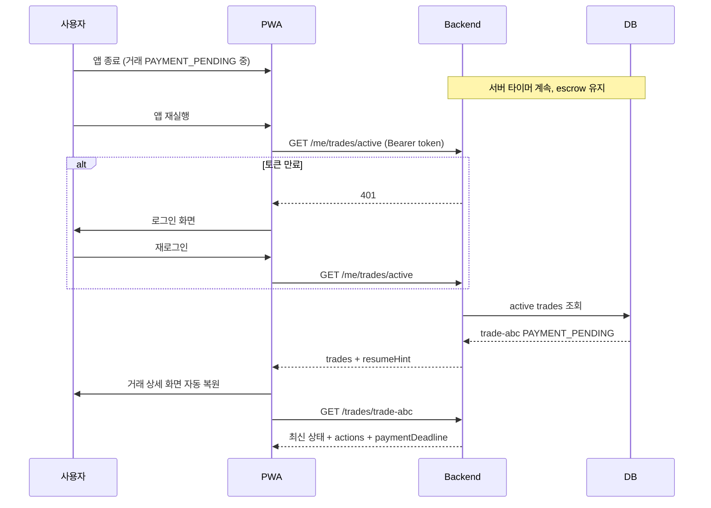

> **문서 위치 안내:** 프론트 기준 req/res·fixture는 [docs/domains/api-spec.md](../domains/api-spec.md)를 먼저 참고하세요.  
> 도메인 요약은 [docs/domains/trade.md](../domains/trade.md).  
> 이 파일은 거래 백엔드 구현 상세 Draft입니다. (`porcess`는 historical typo 경로)

# Brit 거래 API 프로세스

이 문서는 **Brit** 거래 백엔드 API의 설계 원칙·엔드포인트·상태 전이·이상 방지 규칙을 정의합니다.  
거래 중 세션 종료·앱(PWA) 종료 후에도 **서버가 단일 진실(Single Source of Truth)** 을 유지하고, 재진입 시 동일 거래를 복원하는 것을 최우선 목표로 합니다.

**버전**: Draft v0.2  
**관련 문서**: [trade-process.md](./trade-process.md), [trade-scenarios.md](./trade-scenarios.md), [trade-disputes.md](./trade-disputes.md), [trade-payment-ux.md](./trade-payment-ux.md), [trade-platform-summary.md](../architecture/trade-platform-summary.md), [merchant.md](../domains/merchant.md)

---

## 1. 설계 원칙

| 원칙 | 설명 |
|------|------|
| **서버 주도 상태** | 거래 상태는 DB에만 존재. 클라이언트는 캐시·UI일 뿐 |
| **세션 ≠ 거래** | JWT/세션 만료 ≠ 거래 취소. 재로그인 후 같은 거래로 복귀 |
| **멱등성(Idempotency)** | 입금 신고·확인·취소는 중복 요청해도 결과 동일 |
| **낙관적 잠금** | `version` 필드로 동시 수정(양쪽이 동시에 확인 등) 방지 |
| **서버 타이머** | 입금 기한·매칭 만료는 클라이언트 clock이 아닌 서버 기준 |
| **원자적 정산** | 코인 이동은 DB 트랜잭션 + 원장(Ledger) 기록 |
| **복구 우선 API** | 앱 재진입 시 `active trades` 조회가 가장 먼저 호출 |

> **중요**: "세션이 종료되어도 거래가 안 끊긴다"는 **인증 토큰 없이도 거래가 진행된다**는 뜻이 아닙니다.  
> 거래 **엔티티·타이머·에스크로**는 서버에서 계속 돌고, 사용자는 **재인증 후** 이어서 행동합니다.

---

## 2. 엔티티 계층

```
TradeOrder       사용자 의사 (BUY/SELL, OPEN)
     │
     ▼
MatchProposal    후보·양쪽 승인 (BROWSING → PENDING_APPROVAL → CONFIRMED = Binding)
     │
     ▼
Trade            입금·확인 상태 머신 (PAYMENT_* → COMPLETED)
     ↑
SplitGroup       leg N개 묶음 (위젯 리스트·진행률)
     │
DisputeCase      분쟁·CS 중재 (Trade 1건당 active 0..1)
```

### TradeOrder vs MatchProposal vs Trade

| 엔티티 | 역할 | 주요 상태 |
|--------|------|-----------|
| `TradeOrder` | "50만원 판매 등록" **의사** | `OPEN`, `MATCHED`, `CANCELLED`, `EXPIRED` |
| `MatchProposal` | 후보 선택 + **양쪽 승인** | `BROWSING`, `PENDING_APPROVAL`, `CONFIRMED`, `WITHDRAWN`, `EXPIRED` |
| `Trade` | Binding 이후 **실거래** | `PAYMENT_PENDING` … `COMPLETED` |
| `SplitGroup` | 분할 묶음·진행률 | `IN_PROGRESS`, `COMPLETED`, … |

**Binding** = `MatchProposal.status → CONFIRMED` 직후 `Trade` 생성·`PAYMENT_PENDING`.  
이 시점부터 일반 `cancel` API 거부 (`BINDING_LOCKED`).

### 분할 판매 구조 (MVP)

```
SplitGroup (total 1,500,000 / completedKrw / progressPercent)
  ├── Leg 1: TradeOrder → Proposal → Trade → COMPLETED
  ├── Leg 2: TradeOrder → Proposal → Trade → PAYMENT_REPORTED
  └── Leg 3: TradeOrder → Proposal (BROWSING) — 매칭 큐 등록됨
```

- 주문 등록 시 **모든 leg 동시 매칭 큐 등록** (1-A)
- 입금·확인은 **leg 단위 독립** (여러 `PAYMENT_PENDING` 동시 가능)
- 사용자당 active: **split 전체 1세트** (B-1) — `ACTIVE_TRADE_LIMIT`은 `splitGroupId` 기준
- escrow: 등록 시 **총액 한 번에 잠금**, leg `COMPLETED` 시 해당 분만 차감

---

## 3. 상태 머신 (서버 강제)

### 3.1 MatchProposal (매칭·승인)

```text
BROWSING → PENDING_APPROVAL → CONFIRMED (= Binding)
    │              │
    └──────────────┴──→ WITHDRAWN / EXPIRED / CANCELLED
```

| From | To | 트리거 | 취소 가능 |
|------|-----|--------|-----------|
| — | `BROWSING` | 주문 등록·큐 진입 | ✅ |
| `BROWSING` | `PENDING_APPROVAL` | `POST .../proposals` | ✅ |
| `PENDING_APPROVAL` | `CONFIRMED` | 양쪽 `POST .../approve` | ✅ (철회) |
| `CONFIRMED` | — | `Trade` 생성 | ❌ Binding |

### 3.2 Trade (입금·확인)

프론트 `TradeStatus` — Proposal 단계는 `GET .../matching`의 `phase`로 표현:

```typescript
export type TradeStatus =
  | 'PAYMENT_PENDING'
  | 'PAYMENT_REPORTED'
  | 'DISPUTED'
  | 'COMPLETED'
  | 'CANCELLED'
  | 'EXPIRED'
```

> 레거시 `MATCHING`은 **Proposal `BROWSING`/`PENDING_APPROVAL`** 에 해당. 신규 API는 분리.

```text
PAYMENT_PENDING → PAYMENT_REPORTED → COMPLETED
       │                  │
       │                  ├── deny-payment / disputes → DISPUTED
       │                  │
       └──────────────────┴──→ EXPIRED (Binding 이후 일반 CANCEL 불가)
       
DISPUTED ──(CS resolve)──→ PAYMENT_PENDING | PAYMENT_REPORTED | COMPLETED | CANCELLED
```

### 3.3 Trade — 분쟁 (`DISPUTED`)

상세 시나리오: [trade-disputes.md](./trade-disputes.md)

| From | To | 트리거 | 액터 |
|------|-----|--------|------|
| `PAYMENT_REPORTED` | `DISPUTED` | `deny-payment` / `disputes` | 판매자·양쪽 |
| `PAYMENT_PENDING` | `DISPUTED` | `disputes` (입금 주장 등) | 양쪽 |
| `DISPUTED` | `PAYMENT_PENDING` | CS `RESUME` | CS |
| `DISPUTED` | `PAYMENT_REPORTED` | CS `RESUME` | CS |
| `DISPUTED` | `CANCELLED` | CS `VOID_TRADE` | CS |
| `DISPUTED` | `COMPLETED` | CS `FORCE_COMPLETE` / `FORCE_REVERSAL` | CS |

- `DISPUTED` 진입 시 `SET trade:disputed:{tradeId}` — 만료 크론 스킵
- split: **해당 leg만** freeze

### 허용 전이 (Trade)

| From | To | 트리거 | 액터 |
|------|-----|--------|------|
| — | `PAYMENT_PENDING` | Proposal `CONFIRMED` (Binding) | 시스템 |
| `PAYMENT_PENDING` | `PAYMENT_REPORTED` | 입금 신고 | 구매자 |
| `PAYMENT_PENDING` | `EXPIRED` | 입금 기한 초과 | 크론 |
| `PAYMENT_REPORTED` | `DISPUTED` | 미수신 신고 / 분쟁 | 판매자·양쪽 |
| `PAYMENT_REPORTED` | `COMPLETED` | 입금 확인 | 판매자 |
| `PAYMENT_REPORTED` | `EXPIRED` | 확인 기한(정책) | 크론 |

Proposal 단계 취소: `POST .../proposals/{id}/withdraw` 또는 `POST .../cancel` (order 단위).

### 이상 방지 규칙

- 잘못된 전이 → `409 Conflict` + 현재 상태 반환 (클라이언트 동기화)
- `COMPLETED` / `CANCELLED` / `EXPIRED` → **모든 변경 API 거부** (terminal)
- 상태 변경 시 `version` +1, `updatedAt` 갱신

---

## 4. API 엔드포인트

### 4.1 복구·진입 (가장 중요)

앱/PWA 재진입, 탭 복귀, cold start 시 **항상 서버부터** 조회합니다.

#### `GET /v1/me/trades/active`

**응답 예시**

```json
{
  "trades": [
    {
      "id": "trade-abc",
      "role": "BUYER",
      "status": "PAYMENT_PENDING",
      "amountKrw": 100000,
      "coinAmount": 100,
      "version": 3,
      "paymentDeadline": "2026-07-07T10:45:00+09:00",
      "splitGroupId": null,
      "updatedAt": "2026-07-07T10:15:00+09:00"
    }
  ],
  "splitGroups": [
    {
      "id": "split-xyz",
      "status": "IN_PROGRESS",
      "totalAmountKrw": 1500000,
      "completedCount": 1,
      "totalCount": 3,
      "trades": []
    }
  ],
  "resumeHint": {
    "primaryTradeId": "trade-abc",
    "primarySplitGroupId": null
  }
}
```

**클라이언트 동작**

1. 앱 시작 / foreground 복귀 → `GET /me/trades/active`
2. `resumeHint.primaryTradeId` 있으면 거래 상세로 deep link
3. 로컬 `lastTradeId`는 **힌트만** — 서버 응답이 우선

#### `GET /v1/trades/{tradeId}`

- 상세: 상대방 마스킹 정보, 계좌, 타임라인, 허용 액션 목록
- `actions: ["REPORT_PAYMENT", "CANCEL"]` — 역할·상태에 따라 서버가 계산

#### `GET /v1/split-groups/{splitGroupId}`

- 분할 판매 전체 진행률 + 자식 Trade 목록

---

### 4.2 거래 생성

#### `POST /v1/trade-orders`

**Headers**

```
Idempotency-Key: {client-generated-uuid}
Authorization: Bearer {token}
```

**Body (구매)**

```json
{
  "side": "BUY",
  "amountKrw": 100000
}
```

**Body (판매, 분할)**

```json
{
  "side": "SELL",
  "amountKrw": 1500000,
  "splitMode": "AUTO"
}
```

**서버 처리 (트랜잭션)**

1. 사용자 active trade 수 제한 검사
2. SELL: `availableMs ≥ coinAmount` → `escrowMs` 이동 (원장 기록)
3. `TradeOrder` 생성
4. 분할: `SplitGroup` + N개 `TradeOrder` 생성
5. 매칭 엔진 큐에 등록
6. 매칭 성공 시 `Trade` 생성 → `MATCHING` 또는 `PAYMENT_PENDING`

**멱등성**: 같은 `Idempotency-Key` → 같은 order/trade 반환 (중복 생성 방지)

---

### 4.3 매칭 API (클라이언트)

#### `GET /v1/trade-orders/{orderId}/matching`

- `matchMode`: `EXACT_AUTO` | `FLEXIBLE_LIST` (서버 결정, 클라 토글 없음)
- `phase`: `BROWSING` | `PENDING_APPROVAL`
- `candidates[]`, `pendingMatch`, `proposalExpiresAt`

#### `POST /v1/trade-orders/{orderId}/proposals`

```json
{ "candidateOrderId": "order-sell-2", "idempotencyKey": "..." }
```

→ `PENDING_APPROVAL`, 상대에게 알림.

#### `POST /v1/trade-orders/{orderId}/proposals/{proposalId}/approve`

```json
{ "version": 1 }
```

양쪽 완료 시:

1. Proposal `CONFIRMED`
2. `Trade` 생성 `PAYMENT_PENDING`
3. `paymentDeadline` 설정
4. 이벤트 `TRADE_BOUND` → Push / SSE / `pendingNotifications`

#### `POST /v1/trade-orders/{orderId}/proposals/{proposalId}/withdraw`

Binding 전 제안 철회 → `BROWSING` 복귀.

---

### 4.4 매칭 알고리즘 (백엔드)

#### 목표

- 동일 금액 **1:1** C2C 페어링
- `EXACT_AUTO`: 정확 일치 1명 → 승인 시트 직행
- `FLEXIBLE_LIST`: `NEAR` 후보 리스트 (허용 오차 정책, MVP ±0원 또는 ±1,000원)
- split leg **병렬** 매칭 (등록 직후 N건 큐)
- **FIFO** + (향후) 신뢰 점수 가중

#### `matchMode` 결정

```text
IF pool에 requestedAmountKrw EXACT 반대편 주문 ≥ 1
  → EXACT_AUTO (단일 후보 또는 자동 propose 대상)
ELSE
  → FLEXIBLE_LIST (NEAR 금액 범위 검색)
```

#### 페어링 규칙

| 규칙 | 값 (MVP) |
|------|----------|
| 페어 | 1 BUY order ↔ 1 SELL order |
| 금액 | leg `amountKrw` 정확 일치 (EXACT) |
| NEAR | `abs(a-b) ≤ NEAR_TOLERANCE_KRW` (기본 0) |
| 동시 active | 사용자당 `splitGroup` 1개 또는 단건 1개 |
| 자기 매칭 | 동일 `userId` 페어 **금지** |
| 이미 Proposal 중 | 해당 order는 풀에서 **locked** |

#### 워커 플로우 (`MatchingWorker`)

```text
1. Redis 큐에서 orderId pop (또는 due scan)
2. 반대 side 풀에서 후보 조회 (ZSET by amount)
3. EXACT 1명 → (정책) 자동 propose 또는 후보만 노출
4. FLEXIBLE → 상위 N명(기본 5) 반환, dismissed 제외
5. propose 시 양쪽 order lock (Redis SETNX)
6. approve 양쪽 완료 → DB 트랜잭션: Proposal CONFIRMED + Trade 생성
7. unlock 실패·타임아웃 → Proposal EXPIRED, 풀 재등록
```

#### 내부 엔드포인트

#### `POST /v1/internal/matching/run`

워커/크론이 주기 호출. 큐 적체 시에만 DB 폴백 스캔.

#### `POST /v1/internal/matching/expire-proposals`

`proposalExpiresAt < now()` → `EXPIRED`, order unlock.

---

### 4.5 Redis 데이터 구조

PostgreSQL이 **단일 진실**, Redis는 **매칭 풀·락·이벤트·디바운스**용.

| Key | Type | 용도 | TTL |
|-----|------|------|-----|
| `matching:buy:{amountKrw}` | ZSET | score=createdAt, member=orderId | — |
| `matching:sell:{amountKrw}` | ZSET | 동일 | — |
| `matching:near:buy` | ZSET | 금액 인덱스 (FLEXIBLE) | — |
| `order:lock:{orderId}` | STRING | propose 중 lock | 15m |
| `proposal:pending:{proposalId}` | HASH | 양쪽 approve 상태 | 15m |
| `user:active:split:{userId}` | STRING | active splitGroupId | — |
| `notify:debounce:{userId}:{splitGroupId}` | STRING | Binding 알림 묶기 | 30s |
| `trade:disputed:{tradeId}` | STRING | 분쟁 중 만료 크론 스킵 | dispute 종료 시 DEL |
| `events:user:{userId}` | STREAM | SSE / 폴링 보조 | 24h |

**ZADD (주문 등록 시)**

```text
ZADD matching:sell:500000  {unix_ms}  order-leg-3
SADD  split:group:split-xyz:orders  order-leg-3
SET   user:active:split:{sellerId}  split-xyz
```

**EXACT 조회**

```text
ZRANGE matching:buy:500000 0 0   # FIFO 최우선
# locked order는 skip
```

**Binding 이벤트 (디바운스)**

```text
SET notify:debounce:{userId}:{splitGroupId} 1 EX 30 NX
# NX 성공 시에만 Push 발송; 실패 시 legId만 누적 → 30s 후 일괄 "매칭 2건 완료"
XADD events:user:{userId}  *  type TRADE_BOUND  splitGroupId  ...  focusLeg  2
```

**주의**

- 정산·escrow·Trade 상태는 **항상 DB 트랜잭션**
- Redis 장애 시: DB `TradeOrder WHERE status=OPEN` 폴백 스캔 (느리지만 안전)
- Redlock 대신 **order 단위 SETNX** + DB optimistic lock 병행

---

### 4.6 알림 · 실시간 이벤트

| 이벤트 | 수신 | 채널 | 페이로드 |
|--------|------|------|----------|
| `MATCHING_QUEUED` | 본인 | (UI only) | orderId, legIndex |
| `PROPOSAL_RECEIVED` | 상대 | Push / 배너 | proposeId, nickname |
| `TRADE_BOUND` | 양쪽 | Push / 배너 / SSE | splitGroupId, focusLeg, tradeId |
| `PAYMENT_REPORTED` | 판매자 | Push | tradeId, amountKrw |
| `TRADE_COMPLETED` | 양쪽 | Push | tradeId, wallet snapshot |
| `TRADE_EXPIRED` | 양쪽 | Push | tradeId, reason |
| `DISPUTE_OPENED` | 양쪽 | Push / 배너 | disputeId, tradeId |
| `DISPUTE_RESOLVED` | 양쪽 | Push | resolution, tradeId |

`GET /me/trades/active` 응답에 `pendingNotifications[]` 포함 (앱 foreground 동기화).

```json
{
  "pendingNotifications": [
    {
      "type": "TRADE_BOUND",
      "splitGroupId": "split-xyz",
      "focusLeg": 2,
      "tradeId": "t2",
      "amountKrw": 500000,
      "message": "매칭됐어요 · 이○○님과 거래할 수 있어요"
    }
  ]
}
```

Trade 화면에 있으면 배너 생략, `focusLeg`로 시트만 오픈.

---

### 4.7 입금 신고 (구매자)

#### `POST /v1/trades/{tradeId}/report-payment`

**Headers**

```
Idempotency-Key: {uuid}
Authorization: Bearer {token}
```

**Body**

```json
{
  "version": 3
}
```

**서버**

1. `version` 일치 확인 (불일치 → 409 + 최신 Trade 반환)
2. `PAYMENT_PENDING` → `PAYMENT_REPORTED`만 허용
3. `reportedAt` 기록, 판매자에게 알림
4. 이미 `PAYMENT_REPORTED`면 **200 + 동일 결과** (멱등)

---

### 4.8 입금 확인 (판매자)

#### `POST /v1/trades/{tradeId}/confirm-payment`

**Headers**

```
Idempotency-Key: {uuid}
Authorization: Bearer {token}
X-PIN-Token: {step-up-token}   // 향후: 민감 액션 재인증
```

**Body**

```json
{
  "version": 4
}
```

**서버 (단일 DB 트랜잭션 — 가장 critical)**

```
BEGIN
  1. Trade status = PAYMENT_REPORTED, version 검증
  2. Trade status → COMPLETED
  3. seller escrowMs -= coinAmount
  4. buyer availableMs += coinAmount
  5. LedgerEntry × 2 (seller OUT, buyer IN)
  6. TradeOrder 양쪽 → MATCHED/CLOSED
  7. SplitGroup completedCount 갱신
COMMIT
```

- 중간 실패 → 전체 롤백 (코인 이중 지급 방지)
- 이미 `COMPLETED` → 멱등 200

---

### 4.9 취소

#### `POST /v1/trades/{tradeId}/cancel` (Binding 이후 **거부**)

#### `POST /v1/trade-orders/{orderId}/cancel` (Proposal / OPEN 단계)

**Headers**

```
Idempotency-Key: {uuid}
Authorization: Bearer {token}
```

**Body**

```json
{
  "version": 2,
  "reason": "USER_REQUEST"
}
```

**서버**

- **Binding 전**: Proposal `WITHDRAWN` / Order `CANCELLED`, Redis order unlock
- **Binding 후** (`PAYMENT_*`): `409 BINDING_LOCKED` — 고객센터만
- SELL escrow → available 복원 (해당 leg만)

---

### 4.10 만료 (서버 크론 — 클라이언트 무관)

#### `POST /v1/internal/trades/expire-due` (매 1분)

- `paymentDeadline < now()` && `PAYMENT_PENDING` → `EXPIRED`
- `matchingDeadline < now()` && Proposal `BROWSING` → `EXPIRED`
- `proposalExpiresAt < now()` && `PENDING_APPROVAL` → `EXPIRED`
- escrow 복원, 양측 알림

**웹앱을 닫아도** 만료는 서버에서 처리됩니다.

`DISPUTED` trade는 `trade:disputed:{id}` 존재 시 **만료 크론 제외**.

---

### 4.11 분쟁 API

상세: [trade-disputes.md](./trade-disputes.md)

#### `POST /v1/trades/{tradeId}/withdraw-payment-report`

구매자 입금 신고 자진 철회. 조건: `PAYMENT_REPORTED`, 판매자 미확인, `reportedAt` 후 10분 이내.

**Response `200`:** `{ "trade": { "status": "PAYMENT_PENDING", ... } }`

#### `POST /v1/trades/{tradeId}/deny-payment`

판매자 미수신 신고 → `DISPUTED` + `DisputeCase` 자동 생성.

**Request:** `{ "version": N, "reason": "NOT_RECEIVED", "message": "..." }`

#### `POST /v1/trades/{tradeId}/disputes`

**Request:**

```json
{
  "reason": "WRONG_ACCOUNT",
  "message": "다른 건 계좌로 보낸 것 같아요"
}
```

**Response `201`:**

```json
{
  "dispute": {
    "id": "disp-1",
    "tradeId": "t2",
    "status": "OPEN",
    "reason": "WRONG_ACCOUNT"
  },
  "trade": { "id": "t2", "status": "DISPUTED", "version": 5 }
}
```

#### `GET /v1/disputes/{disputeId}` / `GET .../messages` / `POST .../messages`

당사자 채팅. CS는 `UNDER_REVIEW` 시 `cs_agent` participant 추가.

#### `POST /v1/internal/disputes/{disputeId}/resolve`

**Request (CS):**

```json
{
  "resolution": "RESUME",
  "targetStatus": "PAYMENT_PENDING",
  "extendPaymentDeadlineMinutes": 30,
  "comment": "이체 확인 지연 — 기한 연장"
}
```

| `resolution` | 효과 |
|--------------|------|
| `RESUME` | Trade 상태 복귀 + (선택) deadline 연장 |
| `VOID_TRADE` | `CANCELLED`, escrow 복원 |
| `FORCE_COMPLETE` | `COMPLETED`, 정산 |
| `FORCE_REVERSAL` | 역정산 + 제재 로그 |

---

## 5. 세션·인증과 거래의 관계

```
┌─────────────────────────────────────────────────────────┐
│  Auth Session (JWT, refresh token)                       │
│  - 만료 가능                                             │
│  - 재로그인으로 갱신                                     │
└─────────────────────────────────────────────────────────┘
         │ 인증 필요 (행동 API)
         ▼
┌─────────────────────────────────────────────────────────┐
│  Trade (서버 DB)                                         │
│  - 세션과 무관하게 존재                                  │
│  - 타이머·에스크로·상태는 서버가 관리                    │
└─────────────────────────────────────────────────────────┘
```

| API | 인증 | 세션 만료 시 |
|-----|------|--------------|
| `GET /me/trades/active` | 필요 | 401 → 로그인 → **같은 거래 복원** |
| `GET /trades/{id}` | 필요 | 동일 |
| `POST report/confirm/cancel` | 필요 + (향후) PIN | 401 → 재인증 후 재시도 |
| Push 알림 | — | 딥링크 `brit://trade/{id}` |

**PIN 재인증** (민감 액션): `confirm-payment`, `cancel`(PAYMENT_PENDING) 시  
`X-PIN-Token` 또는 짧은 TTL의 step-up token — 거래 **상태**와는 별개.

---

## 6. PWA / 앱 종료 후 복구 플로우



**클라이언트 보조 (선택, 서버 대체 불가)**

- `localStorage.lastActiveTradeId` — deep link 힌트만
- Service Worker push — "입금 확인해 주세요"
- **상태 저장은 서버만** — localStorage에 status 캐시하지 않음

---

## 7. 분할 판매 API 프로세스

### 생성

```
POST /v1/trade-orders  (splitMode: AUTO, amountKrw: 1_500_000)
  → SplitGroup 생성
  → TradeOrder × 3 (각 500,000)
  → escrow: 총 1,500 MS 한 번에 잠금
  → Redis: leg 3건 동시 matching 큐 등록
```

#### `GET /v1/trade-orders/split-preview?amountKrw=1500000`

```json
{
  "totalAmountKrw": 1500000,
  "unitAmountKrw": 500000,
  "legCount": 3,
  "message": "150만 원을 3번에 나눠 거래해요 (50만 원씩)"
}
```

### 조회 (재진입 · 위젯 리스트)

#### `GET /v1/split-groups/{id}`

```json
{
  "id": "split-xyz",
  "side": "SELL",
  "status": "IN_PROGRESS",
  "totalAmountKrw": 1500000,
  "completedKrw": 500000,
  "progressPercent": 33,
  "unitAmountKrw": 500000,
  "totalLegs": 3,
  "completedLegs": 1,
  "legs": [
    {
      "index": 1,
      "orderId": "o1",
      "tradeId": "t1",
      "amountKrw": 500000,
      "status": "COMPLETED",
      "uiPhase": "done",
      "primaryAction": "VIEW_DETAIL",
      "counterpartyNickname": "김○○",
      "statusLine": "입금을 확인했어요"
    },
    {
      "index": 2,
      "orderId": "o2",
      "tradeId": "t2",
      "amountKrw": 500000,
      "status": "PAYMENT_REPORTED",
      "uiPhase": "payment_confirm",
      "primaryAction": "CONFIRM_PAYMENT",
      "counterpartyNickname": "이○○",
      "statusLine": "이○○님이 입금했어요를 눌렀어요"
    },
    {
      "index": 3,
      "orderId": "o3",
      "tradeId": null,
      "amountKrw": 500000,
      "status": "BROWSING",
      "uiPhase": "matching",
      "primaryAction": "VIEW_MATCHING",
      "counterpartyNickname": null,
      "statusLine": "구매자를 찾고 있어요"
    }
  ]
}
```

| SplitGroup status | 설명 |
|-------------------|------|
| `OPEN` | 전부 매칭 대기 |
| `IN_PROGRESS` | 일부 진행/완료 |
| `COMPLETED` | 전부 COMPLETED |
| `PARTIAL_CANCELLED` | 일부 취소/만료 포함 |

### 이상 방지

- 자식 Trade 하나 `COMPLETED` → escrow에서 **해당 coinAmount만** 차감 (전체 해제 X)
- 그룹 전체 취소: `MATCHING`/`OPEN` 자식만 취소, 진행 중 Trade는 정책에 따라 block
- UI 진행률: `completedKrw / totalAmountKrw` (COMPLETED leg 합만)
- 그룹 전체 취소: Proposal `BROWSING` leg만 — Binding 된 leg는 block

---

## 8. 동시성·이상 케이스 방지

| 케이스 | 방지 방법 |
|--------|-----------|
| 입금 신고 두 번 탭 | Idempotency-Key + terminal 상태 체크 |
| 구매·판매 동시 확인 | `version` optimistic lock, 409 시 재조회 |
| 네트워크 끊김 후 재시도 | 멱등 API → 안전 재시도 |
| 앱 종료 중 confirm 요청 | 서버 트랜잭션 atomic, 클라이언트는 재조회 |
| 매칭 중 앱 종료 | 서버 매칭 계속, 재진입 시 `GET active` |
| escrow ≠ trade sum | 정산 시 DB constraint + 원장 대사 배치 |
| clock skew | `paymentDeadline`은 서버 ISO timestamp만 신뢰 |
| stale UI | 거래 상세 진입·foreground마다 `GET /trades/{id}` |
| 이중 active trade | 생성 API에서 `COUNT(active) < limit` DB lock |

### 에러 응답 표준

```json
{
  "error": "TRADE_STATE_CONFLICT",
  "message": "이미 입금 확인된 거래예요.",
  "trade": {},
  "expectedVersion": 5,
  "actualVersion": 6
}
```

클라이언트: 409 수신 → **로컬 상태 버리고** `trade` 객체로 UI 교체.

### 에러 코드

| 코드 | HTTP | 설명 |
|------|------|------|
| `TRADE_STATE_CONFLICT` | 409 | 잘못된 상태 전이 또는 version 불일치 |
| `TRADE_NOT_FOUND` | 404 | 거래 없음 |
| `ACTIVE_TRADE_LIMIT` | 422 | 동시 진행 거래 한도 초과 |
| `INSUFFICIENT_BALANCE` | 422 | 판매 등록 시 코인 부족 |
| `BINDING_LOCKED` | 409 | Binding 이후 취소 시도 |
| `IDEMPOTENCY_REPLAY` | 200 | 멱등 키 재사용 — 기존 결과 반환 |

---

## 9. 실시간 vs 폴링

| 방식 | 용도 |
|------|------|
| **Polling** (MVP) | 거래 상세 5~10초, active 30초, background는 중단 |
| **SSE/WebSocket** | `PAYMENT_REPORTED`, `COMPLETED`, `EXPIRED` push |
| **Push (PWA)** | 앱 종료 시 필수 — 매칭·입금 신고·만료 알림 |

앱이 꺼져 있어도 **상태 변경은 서버 + Push**로 전달. 폴링은 보조.

---

## 10. 원장(Ledger) — 감사·복구

모든 MS 이동은 `LedgerEntry` 기록:

```
ESCROW_LOCK      seller, -100, tradeId
ESCROW_RELEASE   seller, +100, tradeId (cancel)
SETTLE_OUT       seller, -100, tradeId
SETTLE_IN        buyer,  +100, tradeId
```

- `Wallet.availableMs + Wallet.escrowMs` = 원장 합계 (일 배치 대사)
- 이상 감지 시 Trade 상태와 원장 cross-check

---

## 11. API 호출 순서 (클라이언트 체크리스트)

```
[앱 시작]
  1. Auth refresh (있으면)
  2. GET /me/trades/active          ← 필수 (+ pendingNotifications)
  3. resumeHint → GET /split-groups/{id} 또는 GET /trades/{id}

[거래 확인 → 매칭 시작]
  4. GET /trade-orders/split-preview (판매 100만+)
  5. POST /trade-orders (Idempotency-Key)
  6. push /trade?splitGroupId=...
  7. GET /split-groups/{id} (위젯) + GET /trade-orders/{orderId}/matching (leg)

[매칭 propose / approve]
  8. POST .../proposals → POST .../approve (Binding → TRADE_BOUND)

[입금 신고 / 확인]
  9. POST /trades/{id}/report-payment
 10. POST /trades/{id}/confirm-payment

[앱 foreground / Trade 밖]
  → 2, 3 반복 + pendingNotifications → 복귀 배너
```

---

## 12. MVP 백엔드 구현 우선순위

| 순서 | 범위 |
|------|------|
| 1 | TradeOrder + MatchProposal + Trade 상태 머신 |
| 2 | `GET /me/trades/active` + `GET /split-groups/{id}` (위젯·복구) |
| 3 | Redis 매칭 풀 + MatchingWorker |
| 4 | Proposal propose/approve/withdraw |
| 5 | Escrow + Ledger (confirm atomic) |
| 6 | Idempotency + Expire cron (+ disputed skip) |
| 7 | `pendingNotifications` + Push / Redis STREAM |
| 8 | 분쟁 API + 채팅 (M2) |
| 9 | CS 콘솔 + `resolve` (M3) |

---

## 13. 확정·미결정 정책

| # | 항목 | 결정 |
|---|------|------|
| 1 | 동시 active | **split 1세트** (B-1) |
| 2 | Split 매칭 | **등록 직후 전 leg 동시** (1-A) |
| 3 | Binding 알림 | **TRADE_BOUND** + 30s 디바운스 |
| 4 | 입금 기한 | **30분** (초안, `paymentDeadline`) |
| 5 | PAYMENT_PENDING 취소 | **불가** (Binding 후) |
| 6 | PAYMENT_REPORTED 무응답 | **CS만** (MVP) |
| 7 | NEAR_TOLERANCE | **0원** (MVP, 추후 1,000원) |
| 8 | 분쟁 | [trade-disputes.md](./trade-disputes.md) — leg freeze, 10분 철회, CS resolve |

---

## 관련 코드

| 영역 | 경로 |
|------|------|
| 거래 타입·상태 | `src/features/home/types.ts` |
| 거래 한도·환율 | `src/features/home/constants.ts` |
| 분할 정책 | `src/features/home/utils/splitRecommendation.ts` |
| 거래 확인 | `src/activities/TradeConfirmActivity.tsx` |
| 거래 상세 | `src/features/trade/components/TradeDetailScreen.tsx` |
| 프로세스 설계 | `docs/porcess/trade-process.md` |
| 시나리오 E2E | `docs/porcess/trade-scenarios.md` |
| 예외·분쟁 | `docs/porcess/trade-disputes.md` |
