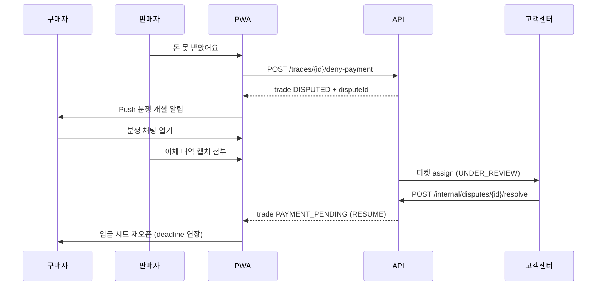

> **문서 위치 안내:** 종합 [trade-platform-summary.md](../architecture/trade-platform-summary.md). 정상 플로우 [trade-scenarios.md](./trade-scenarios.md). 입금 UX [trade-payment-ux.md](./trade-payment-ux.md). API [trade-api.md](./trade-api.md) §4.11, [api-spec.md](../domains/api-spec.md) §5.5.

# Brit 거래 예외·분쟁 처리

Binding 이후 **오조작·미입금·허위 신고** 등 예외 상황과 **분쟁 채팅·고객센터(CS) 중재**를 정의합니다.

**버전**: Draft v0.1 (2026-07-09)

---

## 1. 설계 원칙

| 원칙 | 설명 |
|------|------|
| **Binding 이후 사용자 취소 불가** | 실수·분쟁은 일반 `cancel`이 아니라 **분쟁 채널**로 |
| **돈·코인은 서버만** | CS도 UI 임의 조작 불가 → **정해진 resolution API**만 |
| **분쟁 중 타이머 정지** | `DISPUTED` 진입 시 `paymentDeadline` 크론 **일시 정지** |
| **leg 단위 freeze** | split 3건 중 1건만 분쟁 → **해당 leg만** 잠금, 나머지 leg 계속 |
| **채팅 ≠ 판결** | 채팅은 소통·증빙, **종료는 CS resolution**으로만 |
| **예방 우선** | 입금/확인 CTA는 **확인 다이얼로그** + 건 번호·금액 고정 표시 |

---

## 2. Trade 상태 확장 — `DISPUTED`

### 2.1 상태 다이어그램

```text
PAYMENT_PENDING ──(입금 기한, 분쟁 없음)──→ EXPIRED
       │
       │ 구매자 「입금했어요」
       ▼
PAYMENT_REPORTED ──(판매자 확인)──→ COMPLETED
       │                    │
       │ 판매자 「못 받았어요」  │ 판매자 실수 확인 (사후 CS)
       ▼                    ▼
    DISPUTED ──(CS resolve)──→ PAYMENT_PENDING | COMPLETED | CANCELLED
       │
       └── 타이머 정지 (Redis trade:disputed:{tradeId})
```

### 2.2 상태별 사용자 액션

| 상태 | 구매자 | 판매자 | 타이머 |
|------|--------|--------|--------|
| `PAYMENT_PENDING` | 입금하기, 문제 신고 | 대기, 입금 독촉(리마인드) | ⏱ 동작 |
| `PAYMENT_REPORTED` | 신고 철회(조건부), 대기 | 돈 받았어요, **못 받았어요** | ⏱ 동작 |
| `DISPUTED` | 분쟁 채팅 | 분쟁 채팅 | ⏸ 정지 |
| terminal | — | — | — |

### 2.3 프론트 타입 (목표)

```typescript
export type TradeStatus =
  | 'PAYMENT_PENDING'
  | 'PAYMENT_REPORTED'
  | 'DISPUTED'      // 신규
  | 'COMPLETED'
  | 'CANCELLED'
  | 'EXPIRED'
```

레거시 `MATCHING`은 Proposal 단계(`GET .../matching`)로 이전.

---

## 3. 엔티티

```text
Trade (leg 1건)
  └── DisputeCase (active 0..1)
        ├── reason: DisputeReason
        ├── status: OPEN | UNDER_REVIEW | RESOLVED
        ├── resolution?: DisputeResolution
        └── DisputeRoom
              ├── participants: buyer, seller, cs_agent?
              └── messages[] (text, image_attachment)
```

### DisputeReason

| 값 | 설명 | 주로 제기자 |
|----|------|-------------|
| `FALSE_REPORT` | 입금 안 했는데 입금 신고 | 구매자 철회 / 판매자 신고 |
| `NOT_RECEIVED` | 입금 신고됐으나 미수신 | 판매자 |
| `WRONG_AMOUNT` | 금액 불일치 | 양쪽 |
| `WRONG_ACCOUNT` | 잘못된 계좌·leg로 송금 | 양쪽 |
| `PREMATURE_CONFIRM` | 확인 실수(이미 COMPLETED) | 판매자/구매자 |
| `OTHER` | 기타 | 양쪽 |

### DisputeResolution (CS 전용)

| 값 | Trade 결과 | escrow/코인 | 채팅방 |
|----|-----------|-------------|--------|
| `RESUME` | `PAYMENT_PENDING` 또는 `PAYMENT_REPORTED` 복귀 | 유지 | 닫기 (기록 보관) |
| `VOID_TRADE` | `CANCELLED` | 해당 leg 복원 | 닫기 |
| `FORCE_COMPLETE` | `COMPLETED` | 정산 | 닫기 |
| `FORCE_REVERSAL` | `COMPLETED` 후 역정산 | 원장 역분개 | 닫기 + 제재 로그 |

**방 파기** ≈ `VOID_TRADE` 또는 `RESUME` 후 분쟁 종료.  
**이어서 진행** ≈ `RESUME` (+ `paymentDeadline` 연장).

---

## 4. 예외 시나리오 (E1–E7)

### E1 — 구매자: 입금 안 했는데 「입금했어요」 실수

| 단계 | UX | API |
|------|-----|-----|
| 1 | 실수로 탭 | `POST .../report-payment` → `PAYMENT_REPORTED` |
| 2a | 구매자 즉시 인지 | **「입금 신고를 취소할게요」** (판매자 미확인 + **10분 이내**) |
| 2b | 판매자가 인지 | **「돈 못 받았어요」** | `POST .../deny-payment` → `DISPUTED` |
| 3 | CS 검토 | `resolve: RESUME` → `PAYMENT_PENDING` 또는 `VOID_TRADE` |

**예방:** 「입금했어요」 전 AlertDialog — `실제로 입금하셨나요?`

---

### E2 — 판매자: 「돈 받았어요」 실수 (실제 미수신)

| 단계 | 처리 |
|------|------|
| 탭 직후 | `COMPLETED` + 코인 이동 (**일반 API 롤백 불가**) |
| 예방 | 확인 다이얼로그 + 금액·상대·**N건 · 금액** 재표시 |
| 사후 | `POST .../disputes` `reason: PREMATURE_CONFIRM` → CS `FORCE_REVERSAL` |

---

### E3 — 잘못된 계좌·leg로 송금

| 케이스 | 처리 |
|--------|------|
| 구매자 → 판매자 계좌 (정상) | 일반 플로우 |
| 구매자 → 다른 leg/상대 계좌 | `WRONG_ACCOUNT` 분쟁, CS가 leg 매칭·연장 |
| 판매자 → 구매자에게 역송금 | 플랫폼 밖 실수 — 채팅으로 환불 안내 (앱 강제 회수 불가) |

**예방:** 입금 시트에 **건 번호 · 금액 · 계좌** 3종 고정·복사.

---

### E4 — `PAYMENT_PENDING`에서 구매자 미입금

| 시점 | 동작 |
|------|------|
| deadline 전 | 판매자 카드: `○○님이 입금할 예정이에요` / 리마인드 푸시 1회 |
| deadline 후 | 크론 → `EXPIRED`, escrow leg 복원, **split 다른 leg 계속** |
| 구매자 "입금했는데 pending" | 증빙(이체확인) 첨부 → `POST .../disputes` |

**정책 (초안):** 입금 기한 **30분** (`paymentDeadline`).

---

### E5 — `PAYMENT_REPORTED`에서 판매자 무응답

| 시점 | 동작 |
|------|------|
| +24h | 판매자 푸시 리마인드 |
| +48h | 구매자 카드: **「고객센터에 문의하기」** |
| CS | 이체 대조 → `FORCE_COMPLETE` 또는 `RESUME` |

**정책:** MVP **자동 COMPLETED 없음** (CS만).

---

### E6 — 분쟁 중 split 다른 leg

| 규칙 | 내용 |
|------|------|
| freeze 범위 | **분쟁 leg만** `DISPUTED` — 나머지 위젯·매칭·입금 **활성** |
| 진행률 | `completedKrw`는 COMPLETED leg만 반영 |
| escrow | 분쟁 leg만 freeze, 다른 leg 정산은 독립 |

---

### E7 — 분쟁 채팅 · CS 개입



**채팅 UX**

- Trade 위젯: `⚠ 분쟁 중` — primary CTA 잠금, **「분쟁 채팅 열기」**만
- CS 메시지: 배지 `고객센터`
- consumer-ux: 거래 맥락에서만 진입 (홈 진입 직후 전면 시트 X)
- dismiss: 채팅 닫기 ≠ 분쟁 철회

---

## 5. API 요약

| API | 액터 | 용도 |
|-----|------|------|
| `POST /v1/trades/{id}/withdraw-payment-report` | 구매자 | 입금 신고 자진 철회 (조건부) |
| `POST /v1/trades/{id}/deny-payment` | 판매자 | 미수신 → `DISPUTED` + 분쟁 생성 |
| `POST /v1/trades/{id}/disputes` | 양쪽 | 일반 분쟁 제기 |
| `GET /v1/disputes/{id}` | 당사자 | 상태·resolution |
| `GET /v1/disputes/{id}/messages` | 당사자 | 채팅 목록 |
| `POST /v1/disputes/{id}/messages` | 당사자 | 텍스트·증빙 이미지 |
| `POST /v1/internal/disputes/{id}/assign` | CS | 담당 배정 |
| `POST /v1/internal/disputes/{id}/resolve` | CS | 판결 |
| `GET /v1/internal/trades/{id}/timeline` | CS | 상태·원장·알림 로그 |

상세 req/res: [api-spec.md](../domains/api-spec.md) §5.5.

### withdraw-payment-report 조건

- `trade.status === PAYMENT_REPORTED`
- 판매자 아직 `confirm-payment` 안 함
- `reportedAt` 후 **10분 이내**
- 활성 `DisputeCase` 없음

---

## 6. Redis · 크론

| Key | 용도 |
|-----|------|
| `trade:disputed:{tradeId}` | `1` — 만료 크론 **스킵** |
| `dispute:room:{id}:typing` | (선택) 입력 중 |
| `events:user:{id}` | `DISPUTE_OPENED`, `DISPUTE_RESOLVED` |

**만료 크론 (수정)**

```text
IF status == PAYMENT_PENDING
   AND NOT EXISTS trade:disputed:{tradeId}
   AND paymentDeadline < now()
  → EXPIRED
```

`DISPUTED` 해제(`RESUME`/`VOID`) 시 `DEL trade:disputed:{tradeId}`.

---

## 7. 위젯 카드 (분쟁 시)

| `uiPhase` | 뱃지 | primaryAction | 버튼 |
|-----------|------|---------------|------|
| `dispute` | 분쟁 중 | `OPEN_DISPUTE_CHAT` | 분쟁 채팅 열기 |

`GET /split-groups/{id}` leg 예:

```json
{
  "index": 2,
  "status": "DISPUTED",
  "uiPhase": "dispute",
  "primaryAction": "OPEN_DISPUTE_CHAT",
  "disputeId": "disp-1",
  "statusLine": "입금 확인이 맞지 않아 검토 중이에요"
}
```

---

## 8. 예방 UX 체크리스트 (구현)

1. 「입금했어요」「돈 받았어요」— **AlertDialog** 2단 확인
2. 입금 시트 — **N건 · 금액 · 계좌** 고정 표시
3. `PAYMENT_REPORTED` — 판매자 **「돈 못 받았어요」** 항상 노출
4. `DISPUTED` — 입금/확인 CTA 잠금, 채팅만
5. split — 분쟁 leg만 freeze

---

## 9. MVP 단계

| 단계 | 범위 |
|------|------|
| **M1** | `EXPIRED` 크론, 확인 다이얼로그, `deny-payment` → 외부 티켓 링크 |
| **M2** | `DISPUTED` 상태, 인앱 분쟁 채팅, `withdraw-payment-report` |
| **M3** | CS 콘솔, `resolve` API, `FORCE_REVERSAL`, 신뢰점수 |
| **M4** | 은행 API·증빙 OCR (선택) |

---

## 10. 확정·미결정 정책

| # | 항목 | 결정 (초안) |
|---|------|-------------|
| 1 | 입금 신고 철회 | **가능** — 미확인 + **10분 이내** |
| 2 | 입금 기한 | **30분** |
| 3 | 판매자 무응답 | **자동 완료 없음**, 48h 후 CS CTA |
| 4 | split freeze | **해당 leg만** |
| 5 | 채팅 MVP | M2 인앱 채팅 (M1은 고객센터 링크) |

---

## 11. Fixture · 시나리오

| ID | 설명 | fixture |
|----|------|---------|
| `splitDispute` | 2건 leg 분쟁 중, 1·3건 정상 | `trades/split-group-disputed.json` |
| `disputeChat` | 분쟁 채팅 메시지 샘플 | `disputes/dispute-open-messages.json` |

[scenarios.json](../fixtures/scenarios.json) — `splitDispute` 항목 참고.

---

## 12. 관련 문서

| 문서 | 내용 |
|------|------|
| [trade-platform-summary.md](../architecture/trade-platform-summary.md) | 전체 종합 |
| [trade-scenarios.md](./trade-scenarios.md) | S9–S11 예외 E2E |
| [trade-api.md](./trade-api.md) | §3.3 DISPUTED, §4.11 분쟁 API |
| [trade-process.md](./trade-process.md) | 도메인 원칙 (에스크로·중재) |
