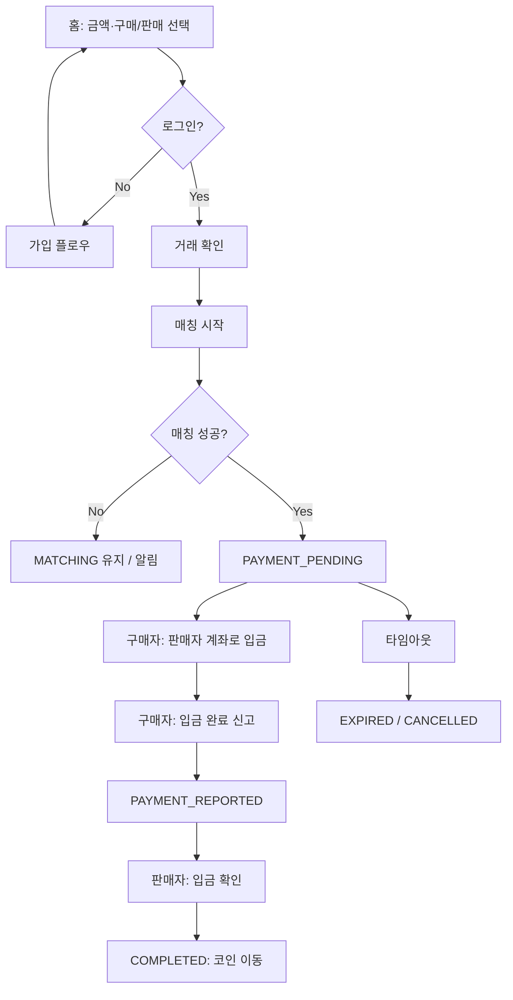

> **문서 위치 안내:** **종합** [docs/architecture/trade-platform-summary.md](../architecture/trade-platform-summary.md).  
> 도메인 요약은 [docs/domains/trade.md](../domains/trade.md)를 먼저 참고하세요.

# Brit 거래 시스템 프로세스 설계

이 문서는 **Brit** 송금·거래 시스템의 UI/UX 흐름과 비즈니스 프로세스를 정의합니다.  
현재 코드베이스에 반영된 가정을 기준으로 하며, 대화를 통해 함께 다듬어 나갑니다.

**버전**: Draft v0.1

---

## 1. 서비스 정의

| 구분 | 설명 |
|------|------|
| **핵심 가치** | 사용자끼리 원화(KRW)와 내부 코인(MS)을 P2P로 교환하는 송금·거래 플랫폼 |
| **1차 목표 (MVP)** | KRW ↔ MS 1:1,000 고정 환율 P2P 매칭 거래 |
| **2차 확장** | 코인 간 교환 (예: MS ↔ 다른 코인) |
| **3차 확장** | 잔여 코인/잔액으로 기프티콘·상품권 구매 |

### 핵심 원칙

- 플랫폼은 **매칭·에스크로(코인 보관)·분쟁 중재** 역할
- 실제 원화 송금은 **사용자 간 계좌 이체** (판매자 계좌 ← 구매자)
- 코인은 거래 완료 시에만 지갑 잔액에 반영

---

## 2. 현재 UI/코드에 반영된 가정

코드에서 이미 정의된 것들:

**거래 상태** (`src/features/home/types.ts`)

```typescript
export type TradeStatus =
  | 'MATCHING'
  | 'PAYMENT_PENDING'
  | 'PAYMENT_REPORTED'
  | 'COMPLETED'
  | 'CANCELLED'
  | 'EXPIRED'
```

**환율·한도** (`src/features/home/constants.ts`)

```typescript
export const MS_TO_KRW = 1_000

export const TRADE_LIMITS = {
  minAmount: 10_000,
  maxAmount: 5_000_000,
} as const
```

| 항목 | 값 |
|------|-----|
| 환율 | 1 MS = 1,000원 (고정) |
| 거래 한도 | 1만 ~ 500만원 |
| 큰 금액 분할 | 100만원 이상 판매 시 50만원 단위 분할 매칭 권장 |
| 인증 선행 | 거래·거래내역·프로필은 가입(본인인증 + 계좌 + PIN) 필요 |

---

## 3. 핵심 도메인 엔티티

```
User          → 본인인증, 계좌, PIN, 신뢰 점수(향후)
Wallet        → coinBalance (MS), estimatedKrwValue
TradeOrder    → 사용자가 등록한 구매/판매 의사 (매칭 대기)
Trade         → 매칭된 1:1 거래 단위 (상태 머신)
TradeSplit    → 큰 판매를 여러 TradeOrder로 쪼갠 그룹
LedgerEntry   → 코인 입출금 원장 (감사·분쟁용)
GiftOrder     → (Phase 3) 기프티콘 구매 주문
```

---

## 4. Phase 1 — KRW ↔ MS P2P 거래 (MVP)

### 4.1 사용자 여정 개요



### 4.2 구매(BUY) 플로우 — 상세

| 단계 | 액터 | 화면/액션 | 시스템 동작 |
|------|------|-----------|-------------|
| 1. 의사 표현 | 구매자 | 홈에서 금액 입력 → "구매하기" | `TradeOrder(side=BUY, amountKrw)` 생성 |
| 2. 확인 | 구매자 | TradeConfirm → "매칭 시작" | 상태 `MATCHING` |
| 3. 매칭 | 시스템 | — | 동일·유사 금액 SELL 주문과 페어링 |
| 4. 계좌 노출 | 구매자 | 거래 상세 | 판매자 마스킹 계좌 표시 |
| 5. 입금 | 구매자 | (외부) 계좌 이체 | — |
| 6. 입금 신고 | 구매자 | "입금했어요" 버튼 | `PAYMENT_REPORTED` |
| 7. 확인 | 판매자 | "입금 확인" | `COMPLETED` |
| 8. 정산 | 시스템 | — | 판매자 MS 차감 → 구매자 MS 증가 |

**구매자 UX 카피** (이미 코드에 있음)

- `PAYMENT_PENDING` / `PAYMENT_REPORTED`: "입금 확인을 기다리고 있어요"

### 4.3 판매(SELL) 플로우 — 상세

| 단계 | 액터 | 화면/액션 | 시스템 동작 |
|------|------|-----------|-------------|
| 1. 잔액 검증 | 판매자 | 금액 입력 | `krwToCoin(amount) ≤ coinBalance` |
| 2. 분할 검토 | 판매자 | 100만+ 시 분할 안내 | `SplitMode: AUTO / CUSTOM / NONE` |
| 3. 등록 | 판매자 | "판매 등록하기" | SELL `TradeOrder` 생성, 코인 **에스크로 잠금** |
| 4. 매칭 | 시스템 | — | BUY 주문과 페어링 |
| 5~8 | 양측 | 구매 플로우와 동일 | 입금 → 확인 → 완료 |

**판매 시 코인 처리 (정책 결정 필요)**

- **권장**: 매칭 전 `availableBalance`에서 차감, `escrowBalance`로 이동
- 완료 시 escrow에서 구매자로 이전
- 취소/만료 시 escrow → available 복원

### 4.4 거래 상태 머신

```
                    ┌─────────────┐
                    │  MATCHING   │ ← 주문 등록 직후
                    └──────┬──────┘
                           │ 매칭 성공
                           ▼
                    ┌─────────────┐
         ┌─────────│PAYMENT_PENDING│ ← 계좌 노출, 입금 대기
         │         └──────┬──────┘
         │                │ 구매자 입금 신고
         │                ▼
         │         ┌─────────────┐
         │         │PAYMENT_     │
         │         │REPORTED     │ ← 판매자 확인 대기
         │         └──────┬──────┘
         │                │ 판매자 확인
         │                ▼
         │         ┌─────────────┐
         │         │  COMPLETED  │ → 코인 정산, 거래내역 기록
         │         └─────────────┘
         │
         │ 타임아웃 / 취소 / 분쟁
         ▼
    CANCELLED / EXPIRED → escrow 해제, 재매칭 가능 여부 결정
```

**각 상태별 허용 액션**

| 상태 | 구매자 | 판매자 | 시스템 |
|------|--------|--------|--------|
| MATCHING | 취소 | 취소 | 자동 매칭, N분 후 EXPIRED |
| PAYMENT_PENDING | 입금 신고, 취소(정책) | 취소(정책) | 입금 기한 타이머 |
| PAYMENT_REPORTED | — | 입금 확인, 미수신 신고 | 자동 리마인드 |
| COMPLETED | — | — | 원장 기록, 알림 |

### 4.5 매칭 정책 (정의 필요)

| 항목 | 제안 초안 |
|------|-----------|
| 매칭 단위 | 1 TradeOrder ↔ 1 Trade (1:1) |
| 금액 허용 오차 | ±0원 (정확 일치) 또는 ±1,000원 |
| 우선순위 | FIFO + (향후) 신뢰 점수 |
| 동시 진행 | 사용자당 active trade 1건 (코드 mock 반영) |
| 분할 매칭 | 100만+ 판매 → 50만 × N건 독립 TradeOrder |

### 4.6 분할(Split) 거래

`src/features/home/utils/splitRecommendation.ts`

```typescript
export const SPLIT_POLICY = {
  thresholdAmount: 1_000_000,
  recommendedUnit: 500_000,
  minSplitUnit: 100_000,
  maxSplitCount: 10,
} as const
```

- **SplitGroup**: 부모 판매 1건 → 자식 TradeOrder N건
- 각 자식은 독립 매칭·독립 상태
- UI: "3건 중 2건 완료" 형태 진행률 표시 (미구현)

### 4.7 가입·인증 선행 조건

현재 가입 플로우:

```
본인확인(이름·주민·통신사·휴대폰)
  → SMS 인증
  → 계좌 등록(은행·계좌번호)
  → PIN 설정
  → 가입 완료
```

**거래 가능 조건 체크리스트**

- [ ] 본인인증 완료 (`isVerified`)
- [ ] 계좌 등록 (판매 시 입금 받을 계좌)
- [ ] PIN 설정 (민감 액션 재인증용, 향후)

---

## 5. Phase 2 — 코인 간 거래 (확장)

Phase 1과 **별도 거래 유형**으로 분리하는 것을 권장합니다.

```
TradeType: KRW_MS | COIN_SWAP
```

| 항목 | KRW ↔ MS | 코인 ↔ 코인 |
|------|----------|-------------|
| 기준 가격 | 고정 (1 MS = 1,000원) | 시장가 / 호가 |
| 결제 수단 | 원화 계좌 이체 | 코인 에스크로만 |
| 매칭 | 금액 기반 | 수량 + 환율 기반 |
| 상태 머신 | 입금 확인 포함 | 에스크로 ↔ 에스크로 (단순화) |

**코인 스왑 상태 (안)**

```
OPEN → MATCHED → BOTH_LOCKED → COMPLETED
                ↘ CANCELLED / EXPIRED
```

Phase 1 원장(`LedgerEntry`)을 재사용하면 Phase 2 추가 시 마이그레이션 부담이 줄어듭니다.

---

## 6. Phase 3 — 기프티콘·상품권 (확장)

잔여 MS로 **1인 거래** (P2P 아님):

```
Wallet(coinBalance) → GiftCatalog 선택 → PIN 확인 → GiftOrder 생성
  → 외부 API(기프티콘 발급) → COMPLETED / FAILED
  → MS 차감 (원장 기록)
```

| 항목 | 정책 |
|------|------|
| 결제 | MS만 (KRW 직접 결제 없음) |
| 환불 | 발급 전 취소만 / 발급 후 불가 (정책 명시) |
| 한도 | 일일·월간 구매 상한 |

---

## 7. 화면 ↔ 프로세스 매핑 (현재 + 필요)

| 화면 | Activity/Route | 프로세스 단계 |
|------|----------------|---------------|
| 홈 | `Home` | 의사 표현, active trade 배너 |
| 거래 확인 | `TradeConfirm` | 확인 → 매칭 시작 |
| 거래 상세 | `Detail/:id` | 입금·확인·상태 추적 (**미완: CTA 없음**) |
| 거래내역 | `Detail/transactions` | COMPLETED/CANCELLED 목록 |
| MY | `Detail/profile` | 계좌, 잔액 |
| 가입 | `Signup*` | 거래 전제 조건 |

### MVP에서 아직 필요한 화면/기능

1. 매칭 중 / 입금 대기 **거래 상세** (계좌 복사, 입금 신고, 확인 버튼)
2. **알림** (매칭됨, 입금 신고됨, 완료)
3. **취소·만료** UX 및 사유
4. **분할 거래** 진행 현황

---

## 8. 비즈니스 규칙 — 확정·미결정

**종합:** [trade-platform-summary.md](../architecture/trade-platform-summary.md) §2, §12.

| # | 항목 | 결정 |
|---|------|------|
| 1 | 동시 active trade | **split 1세트** (B-1) |
| 2 | 입금 대기 | **30분** (초안) |
| 3 | 입금 신고 후 판매자 무응답 | **CS만**, 자동 완료 없음 |
| 4 | 허위 입금 | 철회 10분 / `deny-payment` → 분쟁 ([trade-disputes.md](./trade-disputes.md)) |
| 5 | 분쟁 | 인앱 채팅 + CS resolve (M2) |
| 6 | C2C 수수료 | 없음 (MVP) |
| 7 | C2B 커미션 | **보류** ([merchant.md](../domains/merchant.md)) |
| 8 | 입금 UX | 딥링크·다이얼로그 ([trade-payment-ux.md](./trade-payment-ux.md)) |

미결: NEAR_TOLERANCE, BUY split, leg EXPIRED 정책, `MS_TO_KRW` 통일.

---

## 9. 데이터 모델 스케치 (API 설계 참고)

```typescript
// Phase 1 핵심
interface TradeOrder {
  id: string
  userId: string
  side: 'BUY' | 'SELL'
  amountKrw: number
  coinAmount: number
  status: 'OPEN' | 'MATCHED' | 'CANCELLED' | 'EXPIRED'
  splitGroupId?: string
  createdAt: string
}

interface Trade {
  id: string
  buyOrderId: string
  sellOrderId: string
  buyerId: string
  sellerId: string
  amountKrw: number
  coinAmount: number
  status: TradeStatus
  paymentDeadline?: string
  reportedAt?: string
  completedAt?: string
}

interface Wallet {
  userId: string
  availableMs: number
  escrowMs: number
}
```

---

## 10. 구현 로드맵 제안

| 단계 | 범위 | 산출물 |
|------|------|--------|
| **M1** | 상태 머신 + mock API | 거래 생성→매칭→완료 시나리오 E2E |
| **M2** | 거래 상세 CTA | 입금 신고, 입금 확인 UI |
| **M3** | Wallet escrow | 판매 등록 시 코인 잠금 |
| **M4** | Split + 알림 | 분할 진행률, push/in-app |
| **M5** | 분쟁·만료 | EXPIRED/CANCELLED 정책 |
| **M6+** | 코인 스왑, 기프티콘 | Phase 2/3 |

---

## 11. 다음에 함께 정할 것

[trade-platform-summary.md](../architecture/trade-platform-summary.md) §12 참고. 우선 구현: C2C Trade Activity + 위젯.

---

## 관련 코드

| 영역 | 경로 |
|------|------|
| 거래 타입·상태 | `src/features/home/types.ts` |
| 거래 한도·환율 | `src/features/home/constants.ts` |
| 분할 정책 | `src/features/home/utils/splitRecommendation.ts` |
| 홈 거래 입력 | `src/features/home/components/HomeTradeInput.tsx` |
| 거래 확인 | `src/activities/TradeConfirmActivity.tsx` |
| 거래 상세 | `src/features/trade/components/TradeDetailScreen.tsx` |
| 거래내역 | `src/features/transactions/` |
| 가입 플로우 | `src/activities/auth/` |
