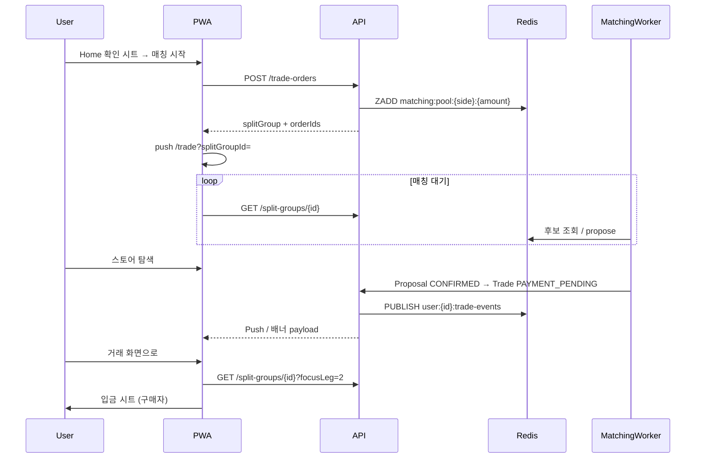

> **문서 위치 안내:** 종합 정리는 [docs/architecture/trade-platform-summary.md](../architecture/trade-platform-summary.md).  
> 도메인 요약은 [docs/domains/trade.md](../domains/trade.md), API req/res는 [docs/domains/api-spec.md](../domains/api-spec.md), 백엔드·매칭·Redis 상세는 [trade-api.md](./trade-api.md)를 참고하세요.

# Brit 거래 시나리오 (C2C MVP)

팀 합의 기준 **E2E 사용자 시나리오**와 API·백엔드 연동 포인트를 정의합니다.

**버전**: Draft v0.2 (2026-07-09)

---

## 1. 확정 정책 요약

| # | 항목 | 결정 |
|---|------|------|
| A | Trade 진입 | `/trade?splitGroupId={id}` (분할) / `/trade?tradeId={id}` (단건) |
| B | 동시 거래 | split 전체 = **진행 중 1세트**. Home에서 **새 거래 불가** (B-1) |
| C | Binding 직후 | 구매자 **입금 시트 자동 오픈** (C-1) |
| D | Split UI | **탭 X** → 세로 **위젯 리스트** + 상세보기. 상단 `완료금액 / 총액` 진행률 |
| E | 거래 시작 | Home **확인 시트** → `POST trade-orders` → `push Trade`. `TradeConfirm` 미사용 |
| F | Split 매칭 | 등록 직후 **모든 leg 동시 매칭** (1-A) |
| G | 입금 | **leg 단위 독립** (여러 건 동시 `PAYMENT_PENDING` 가능) |
| H | 매칭 대기 UX | Trade 안: 스피너·스켈레톤 + 하단 스토어/커뮤니티 링크. Trade 밖: 글로벌 배너 |
| I | 매칭 완료 알림 | Binding 시점. Trade 밖 → 배너/푸시 `매칭됐어요 · 이동할까요?` (나중에 / 거래 화면으로) |
| J | Binding 이후 | 일반 **취소 API 불가** (고객센터만) |
| K | 분쟁 | `DISPUTED` + 분쟁 채팅·CS `resolve`. **leg 단위** freeze |

예외·분쟁 상세: [trade-disputes.md](./trade-disputes.md)

---

## 2. 도메인 3층 모델

```text
TradeOrder      사용자 의사 (BUY/SELL, 금액, OPEN)
      ↓
MatchProposal   후보 선택 + 양쪽 승인 (BROWSING → PENDING_APPROVAL → CONFIRMED = Binding)
      ↓
Trade           PAYMENT_PENDING → PAYMENT_REPORTED → COMPLETED
      ↑
SplitGroup      leg N개 묶음 (위젯 리스트 데이터 소스)
```

| 레이어 | 서버 상태 예 | 프론트 UI |
|--------|-------------|-----------|
| Order | `OPEN`, `MATCHED`, `CANCELLED` | (직접 노출 X, leg 카드에 흡수) |
| Proposal | `BROWSING`, `PENDING_APPROVAL`, `CONFIRMED`, `WITHDRAWN` | 매칭 피드, 승인 시트 |
| Trade | `PAYMENT_*`, `COMPLETED`, … | 위젯 카드 CTA, 입금 시트 |

---

## 3. 화면 구조 (Trade Activity)

```text
┌─────────────────────────────────────────────┐
│ 150만 원 판매 중                             │
│ ████████░░░░  33%   500,000 / 1,500,000     │
│ 50만 원씩 3건으로 나눠 거래해요               │
├─────────────────────────────────────────────┤
│ [1건 위젯] COMPLETED · 상세보기              │
│ [2건 위젯] PAYMENT_REPORTED · [돈 받았어요]  │
│ [3건 위젯] MATCHING · 스켈레톤 · [매칭 보기] │
└─────────────────────────────────────────────┘
```

- Primary CTA는 **카드마다** 노출 (판매: `돈 받았어요`, 구매: `입금하기`, 매칭: `매칭 보기`).
- `매칭 보기` 상세: 스피너 + 후보 스켈레톤 + `WhileYouWaitSection`(스토어/커뮤니티).

---

## 4. 시나리오 카탈로그

### S1 — 판매자: 150만 원 분할 등록

**액터:** 판매자 (코인 150만 MS 보유)

| 단계 | 화면 | API | 서버 |
|------|------|-----|------|
| 1 | Home: 150만 입력 · 판매 | — | — |
| 2 | 확인 시트: `150만 원을 3번에 나눠 거래해요` | `GET /trade-orders/split-preview?amountKrw=1500000` | unit 50만 × 3 반환 |
| 3 | 「매칭 시작」 | `POST /trade-orders` `{ side:SELL, amountKrw:1500000, splitMode:AUTO }` | SplitGroup + Order×3 + escrow 전액 + **leg 3건 매칭 큐 등록** |
| 4 | Trade 위젯 리스트 (0%) | `GET /split-groups/{id}` | legs 3건 `MATCHING` |
| 5 | (선택) 스토어 이동 | `push Detail/store` | 매칭 워커 계속 |
| 6 | Trade 밖 배너 | `GET /me/trades/active` 폴링 | `resumeHint.splitGroupId` |

**기대 결과:** `splitGroupId` 하나로 3 leg 동시 `BROWSING`. Home 새 거래 CTA 비활성.

---

### S2 — 구매자: 50만 원 단건 구매

**액터:** 구매자

| 단계 | 화면 | API | 서버 |
|------|------|-----|------|
| 1 | Home: 50만 · 구매 → 확인 시트 | — | — |
| 2 | 「매칭 시작」 | `POST /trade-orders` `{ side:BUY, amountKrw:500000 }` | Order + 매칭 큐 |
| 3 | Trade (위젯 없음, 단건 UI) | `GET /trade-orders/{orderId}/matching` | `matchMode: EXACT_AUTO \| FLEXIBLE_LIST` |
| 4a | EXACT: 승인 시트 직행 | — | 후보 1명 자동 propose |
| 4b | FLEXIBLE: 후보 리스트 | polling matching | 후보 reveal |

---

### S3 — 매칭 대기 중 탐색 (Trade 밖)

**전제:** leg 또는 단건이 `BROWSING` / `MATCHING` (Proposal 단계)

| 단계 | 화면 | 동작 |
|------|------|------|
| 1 | Trade | 스피너·스켈레톤·하단 링크 표시 |
| 2 | Detail/store | `push` — 거래 상태는 App(`TradeSessionScope`) 유지 |
| 3 | 글로벌 배너 | `매칭 중 · 50만 원 · 거래 이어하기` → `/trade?splitGroupId=...` |
| 4 | 스토어 PageBanner | `매칭이 완료되면 알림으로 알려드릴게요` |

**API:** foreground 30초마다 `GET /me/trades/active`. 매칭 상세는 Trade 진입 시 `GET .../matching`.

---

### S4 — Binding + 복귀 (알림 시점 A)

**전제:** 양쪽 승인 완료 → `Trade.status = PAYMENT_PENDING` (Binding)

| 위치 | UX | API 이벤트 |
|------|-----|-----------|
| Trade 화면 | 배너 없음. 해당 leg 카드 갱신. 구매자 **입금 시트 자동** (C-1) | `GET /split-groups/{id}` |
| Trade 밖 | 인라인 배너: `매칭됐어요 · 이동할까요?` [나중에] [거래 화면으로] | `resumeHint` + `pendingNotifications` |
| 앱 백그라운드 | Push: `매칭됐어요 · 2건 50만 원` 탭 → `/trade?splitGroupId=...&focusLeg=2` | `POST /internal/notifications/trade-bound` |
| split 다건 30초 내 | 알림 **디바운스**: `매칭 2건이 완료됐어요` | Redis `notify:debounce:{userId}:{splitGroupId}` |

**focusLeg 처리:** Trade 진입 후 해당 leg 스크롤 + 구매자 입금 시트. 쿼리 파라미터 1회 소비.

---

### S5 — 병렬 leg 진행 (판매자 3건)

**전제:** 1-A 동시 매칭 + leg별 독립 입금

| 시각 | 1건 | 2건 | 3건 | 상단 진행률 |
|------|-----|-----|-----|------------|
| T0 | MATCHING | MATCHING | MATCHING | 0 / 1,500,000 |
| T1 | COMPLETED | PAYMENT_REPORTED | PAYMENT_PENDING | 500,000 / 1,500,000 |
| T2 | COMPLETED | COMPLETED | MATCHING | 1,000,000 / 1,500,000 |
| T3 | 전부 COMPLETED | — | — | 1,500,000 / 1,500,000 |

- 판매자 2건 카드: `[돈 받았어요]` 동시 노출 가능.
- 구매자 3건 카드: 서로 다른 `tradeId`·상대.

---

### S6 — 입금 · 확인 micro-flow (leg 1건)

| 단계 | 액터 | API | 상태 |
|------|------|-----|------|
| 1 | 구매자 「입금했어요」 | `POST /trades/{id}/report-payment` | `PAYMENT_REPORTED` |
| 2 | 판매자 「돈 받았어요」 | `POST /trades/{id}/confirm-payment` | `COMPLETED` |
| 3 | 시스템 | escrow 정산 + `splitGroup.completedKrw` 갱신 | wallet 반환 |

Binding 이후 `cancel` → **409** `BINDING_LOCKED`.

---

### S7 — 앱 콜드스타트 복구

```text
앱 실행
  → GET /me/trades/active
  → splitGroupId 있으면 GET /split-groups/{id}
  → resumeHint.primarySplitGroupId → /trade?splitGroupId=...
  → focusLeg / pendingNotifications 처리
```

---

### S8 — EXPIRED / CANCELLED (정책 초안)

| 이벤트 | leg 동작 | split |
|--------|----------|-------|
| 매칭 타임아웃 | 해당 Order/Proposal `EXPIRED` → **재매칭 큐** | 다른 leg 계속 |
| 입금 기한 초과 | Trade `EXPIRED`, escrow 해당 leg 복원 | 진행률 유지 |
| Binding 전 취소 | Proposal `WITHDRAWN` / Order `CANCELLED` | 가능 |
| Binding 후 | CS만 (`DISPUTED` → resolve) | — |

---

### S9 — 구매자 입금 신고 실수 (E1)

| 단계 | API | 상태 |
|------|-----|------|
| 실수 신고 | `report-payment` | `PAYMENT_REPORTED` |
| 10분 내 철회 | `withdraw-payment-report` | `PAYMENT_PENDING` |
| 또는 판매자 신고 | `deny-payment` | `DISPUTED` |

---

### S10 — 판매자 미수신 · 분쟁 채팅 (E5/E7)

| 단계 | UX | API |
|------|-----|-----|
| 1 | 「돈 못 받았어요」 | `deny-payment` |
| 2 | 양쪽 Push + 위젯 `분쟁 중` | `GET /disputes/{id}` |
| 3 | 채팅·증빙 | `POST .../messages` |
| 4 | CS 판결 | `POST /internal/.../resolve` `RESUME` |
| 5 | 구매자 입금 시트 재오픈 | deadline +30분 |

---

### S11 — split 중 1건만 분쟁 (E6)

- 2건 leg `DISPUTED` — 카드 CTA: **분쟁 채팅 열기**만
- 1건 `COMPLETED`, 3건 `MATCHING` — **정상 진행**
- Fixture: `split-group-disputed.json`, 시나리오 `splitDispute`

---

## 5. 역할별 카드 CTA 매핑

| leg `primaryAction` | 판매자 버튼 | 구매자 버튼 |
|---------------------|------------|------------|
| `VIEW_MATCHING` | 매칭 보기 | 매칭 보기 |
| `REPORT_PAYMENT` | (없음) | 입금하기 |
| `CONFIRM_PAYMENT` | 돈 받았어요 | (대기 문구) |
| `VIEW_DETAIL` | 상세보기 | 상세보기 |
| `OPEN_DISPUTE_CHAT` | 분쟁 채팅 열기 | 분쟁 채팅 열기 |

서버가 `GET /split-groups/{id}` leg마다 계산해 내려줌.

---

## 6. API 호출 시퀀스 (요약)



---

## 7. Fixture · DEV 시나리오

| 시나리오 ID | 설명 | fixture |
|-------------|------|---------|
| `default` | 진행 중 없음 | `home-default.json` |
| `activeTrade` | 단건 입금 확인 대기 | `trade-payment-reported.json` |
| `splitSell` | 분할 1/3 완료 | `split-group-in-progress.json` |
| `splitMatching` | 3건 전부 매칭 중 | `split-group-all-matching.json` |
| `splitBindingNotify` | 2건 Binding 직후 (배너 테스트) | `split-group-binding-pending.json` |
| `splitDispute` | 2건 분쟁, 1·3건 정상 | `split-group-disputed.json` |

[docs/fixtures/scenarios.json](../fixtures/scenarios.json) 참고.

---

## 8. 관련 문서

| 문서 | 내용 |
|------|------|
| [trade-platform-summary.md](../architecture/trade-platform-summary.md) | **전체 종합** |
| [trade-disputes.md](./trade-disputes.md) | 예외·분쟁·CS |
| [trade-payment-ux.md](./trade-payment-ux.md) | C2C 입금 UX |
| [merchant.md](../domains/merchant.md) | Phase 2 C2B |
| [trade-api.md](./trade-api.md) | 매칭·Redis·API |
| [api-spec.md](../domains/api-spec.md) | req/res·fixture |
| [trade.md](../domains/trade.md) | 도메인 요약 |
| [stackflow/README.md](../stackflow/README.md) | Activity·복귀 |
