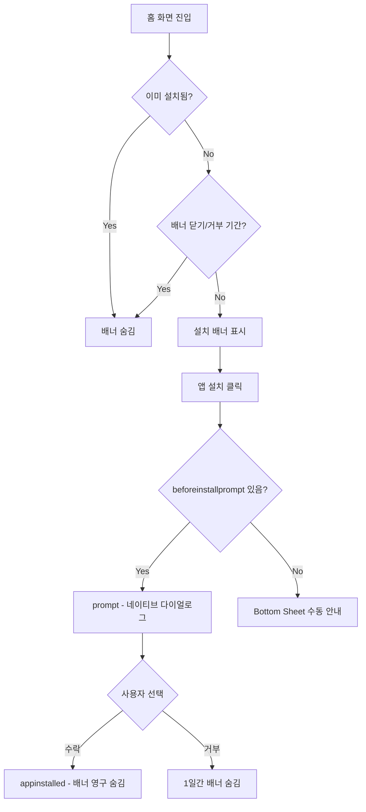

# PWA (Progressive Web App) 학습 노트

이 문서는 **Brit** 프로젝트에 적용한 PWA 기능을 정리한 학습 자료입니다.  
웹 앱을 네이티브 앱처럼 홈 화면에 설치하고, 커스텀 UI로 설치를 유도하는 방법을 코드 기준으로 설명합니다.

---

## 1. PWA와 A2HS란?

**PWA(Progressive Web App)** 는 웹 기술(HTML, CSS, JS)로 만들었지만 앱처럼 동작하는 웹 앱입니다.

**A2HS(Add to Home Screen, 홈 화면에 추가)** 는 브라우저가 제공하는 기능으로, 사용자가 웹 앱을 기기 홈 화면(또는 PC 앱 목록)에 설치할 수 있게 합니다. 설치 후에는 브라우저 주소창 없이 **standalone** 모드로 실행됩니다.

### 왜 쓰는가?

- 브라우저를 열고 URL을 입력하는 번거로움 감소
- 홈 화면/앱 목록에서 한 번의 탭으로 접근
- 네이티브 앱 개발 없이 앱과 유사한 경험 제공

---

## 2. A2HS의 3가지 조건

브라우저가 “설치 가능한 웹 앱”으로 인식하려면 아래 3가지가 필요합니다.

| 조건 | 설명 | 이 프로젝트 |
|------|------|-------------|
| **HTTPS** | 보안 연결로 서비스 제공 | 배포 환경에서 충족 (로컬 dev는 예외) |
| **Web App Manifest** | 앱 이름, 아이콘, 실행 방식을 정의한 JSON | `vite-plugin-pwa`가 `manifest.webmanifest` 생성 |
| **Service Worker** | 네트워크 요청을 가로채 캐시·오프라인 지원 | `vite-plugin-pwa` + Workbox가 자동 등록 |

> 최소 구현만 목표로 할 때는 “빈” Service Worker(`fetch` 리스너만 있는 `sw.js`)만 있어도 A2HS는 동작합니다.  
> 이 프로젝트는 Workbox로 정적 자산 캐싱까지 포함합니다.

---

## 3. 프로젝트 아키텍처 개요

```
┌─────────────────────────────────────────────────────────────┐
│  빌드/인프라 계층                                            │
│  vite.config.ts (VitePWA) → manifest + Service Worker       │
│  index.html → Safari(iOS) 메타·아이콘                        │
└─────────────────────────────────────────────────────────────┘
                              │
                              ▼
┌─────────────────────────────────────────────────────────────┐
│  런타임 설치 유도 계층 (src/features/home/)                   │
│                                                             │
│  usePwaInstallPrompt     beforeinstallprompt / prompt()     │
│  installBannerStorage    배너 노출·재표시 정책 (localStorage)│
│  detectInstallPlatform   iOS/Android/Desktop 안내 문구       │
│  HomeInstallBanner       설치 배너 UI                        │
│  InstallGuideBottomSheet 미지원 환경 수동 안내               │
└─────────────────────────────────────────────────────────────┘
                              │
                              ▼
┌─────────────────────────────────────────────────────────────┐
│  UI 배치                                                    │
│  HomeHeader → HomeInstallBanner (모바일·데스크탑 공통)        │
│  DesktopSidePanel → QR로 모바일 이어하기 (설치와 역할 분리)   │
└─────────────────────────────────────────────────────────────┘
```

---

## 4. 인프라 설정: `vite-plugin-pwa`

**파일:** `vite.config.ts`

`vite-plugin-pwa`가 manifest 생성, Service Worker 등록, Workbox 캐싱을 한 번에 처리합니다.

```ts
VitePWA({
  registerType: 'autoUpdate',        // SW 업데이트 시 자동 반영
  includeAssets: ['favicon.svg', 'icons.svg', 'logo_symbol-gray.png'],
  manifest: {
    name: 'Brit',
    short_name: 'Brit',
    description: '개인 간 코인 거래',
    theme_color: '#ffffff',
    background_color: '#ffffff',
    display: 'standalone',           // 브라우저 UI 없이 앱처럼 실행
    orientation: 'portrait',
    scope: '/',
    start_url: '/',
    icons: [
      { src: 'logo_symbol-gray.png', sizes: '192x192', type: 'image/png', purpose: 'any' },
      { src: 'logo_symbol-gray.png', sizes: '512x512', type: 'image/png', purpose: 'any' },
      { src: 'favicon.svg', sizes: 'any', type: 'image/svg+xml', purpose: 'maskable' },
    ],
  },
  workbox: {
    globPatterns: ['**/*.{js,css,html,ico,png,svg,woff2}'],
    navigateFallback: '/index.html', // SPA 라우팅 fallback
  },
  devOptions: {
    enabled: true,                   // 개발 서버에서도 SW 테스트 가능
  },
})
```

### manifest 주요 필드

| 필드 | 역할 |
|------|------|
| `name` / `short_name` | 설치 시 표시되는 앱 이름 |
| `icons` | 홈 화면 아이콘, 스플래시 이미지 (192·512 권장) |
| `display: standalone` | 주소창·탭 없이 앱 창으로 실행 |
| `start_url` | 앱 실행 시 첫 페이지 (`/`) |
| `theme_color` | 상태 바·타이틀 바 색상 |
| `background_color` | 스플래시 화면 배경 |

### `display` 옵션 비교

| 값 | 동작 |
|----|------|
| `browser` | 일반 브라우저 탭 |
| `standalone` | 브라우저 UI 최소화, 앱처럼 실행 (**이 프로젝트**) |
| `fullscreen` | 화면 전체 (상태 바까지 숨김) |

---

## 5. iOS Safari 보완: `index.html`

iOS Safari는 manifest의 `icons`를 무시하는 경우가 있어, HTML에 별도로 명시합니다.

**파일:** `index.html`

```html
<meta name="apple-mobile-web-app-capable" content="yes" />
<meta name="apple-mobile-web-app-status-bar-style" content="default" />
<meta name="apple-mobile-web-app-title" content="Brit" />
<link rel="apple-touch-icon" href="/logo_symbol-gray.png" />
```

| 태그 | 역할 |
|------|------|
| `apple-mobile-web-app-capable` | Safari에서 전체 화면 웹 앱 모드 허용 |
| `apple-mobile-web-app-title` | 홈 화면 추가 시 앱 이름 |
| `apple-touch-icon` | 홈 화면 아이콘 (PNG 권장) |
| `viewport-fit=cover` | 노치·safe area 대응 |

> iOS는 `beforeinstallprompt`를 지원하지 않습니다. 커스텀 `prompt()` 대신 **수동 안내 UI**(Bottom Sheet)가 필요합니다.

---

## 6. 커스텀 설치 UI: 핵심 개념

### `beforeinstallprompt` 이벤트

Chrome·Edge(모바일·데스크탑)는 사이트가 설치 조건을 만족하면 `beforeinstallprompt`를 발생시킵니다.

```ts
window.addEventListener('beforeinstallprompt', (event) => {
  event.preventDefault()           // 브라우저 기본 설치 배너 억제
  deferredPrompt = event           // 나중에 prompt() 호출용으로 보관
})
```

버튼 클릭 시:

```ts
await deferredPrompt.prompt()      // 네이티브 설치 다이얼로그 표시
const { outcome } = await deferredPrompt.userChoice  // 'accepted' | 'dismissed'
```

### 이미 설치된 상태 감지

```ts
// Android/Chrome PWA
window.matchMedia('(display-mode: standalone)').matches

// iOS Safari
navigator.standalone === true
```

설치 완료 시 `appinstalled` 이벤트도 발생합니다.

---

## 7. 코드별 상세 설명

### 7.1 `usePwaInstallPrompt.ts` — 설치 프롬프트 훅

**경로:** `src/features/home/hooks/usePwaInstallPrompt.ts`

A2HS 글의 `useA2HS` 패턴을 React 훅으로 구현한 파일입니다.

**역할:**

1. `beforeinstallprompt` 수신 → `deferredPrompt` state 저장
2. `appinstalled` 수신 → `isInstalled = true`
3. `promptInstall()` → `deferredPrompt.prompt()` 호출
4. 사용자가 설치 다이얼로그에서 “취소”하면 `recordInstallPromptDismissed()` 호출

**반환값:**

| 값 | 의미 |
|----|------|
| `canPromptInstall` | `deferredPrompt`가 있고 아직 미설치 |
| `isInstalled` | standalone 모드로 실행 중 |
| `isPrompting` | `prompt()` 호출 중 (버튼 로딩) |
| `promptInstall()` | 설치 다이얼로그 실행 함수 |

```ts
export function usePwaInstallPrompt() {
  const [deferredPrompt, setDeferredPrompt] = useState<BeforeInstallPromptEvent | null>(null)

  useEffect(() => {
    const handleBeforeInstallPrompt = (event: Event) => {
      event.preventDefault()
      setDeferredPrompt(event as BeforeInstallPromptEvent)
    }
    window.addEventListener('beforeinstallprompt', handleBeforeInstallPrompt)
    // ...
  }, [])

  const promptInstall = async () => {
    await deferredPrompt.prompt()
    const { outcome } = await deferredPrompt.userChoice
    // ...
  }

  return { canPromptInstall, isInstalled, isPrompting, promptInstall }
}
```

---

### 7.2 `installBannerStorage.ts` — 배너 노출 정책

**경로:** `src/features/home/utils/installBannerStorage.ts`

localStorage 키: `nt-home-install-banner`

| 동작 | 보관 기간 | 함수 |
|------|-----------|------|
| X 버튼으로 배너 닫기 | **7일** | `dismissInstallBanner()` |
| 설치 다이얼로그에서 거부 | **1일** | `recordInstallPromptDismissed()` |
| 배너 표시 여부 판단 | — | `shouldShowInstallBanner()` |

```ts
export function shouldShowInstallBanner(): boolean {
  const data = readStorage()
  if (isWithinWindow(data.dismissedAt, 7일)) return false
  if (isWithinWindow(data.promptDismissedAt, 1일)) return false
  return true
}
```

---

### 7.3 `detectInstallPlatform.ts` — 플랫폼별 안내 문구

**경로:** `src/features/home/utils/detectInstallPlatform.ts`

User-Agent와 뷰포트로 플랫폼을 감지하고, 수동 설치 안내 문구를 반환합니다.

| 플랫폼 | 감지 조건 | 안내 |
|--------|-----------|------|
| `ios` | iPhone/iPad/iPod 또는 iPadOS | Safari 공유 → 홈 화면에 추가 |
| `android` | User-Agent에 Android | Chrome 메뉴 → 앱 설치 |
| `desktop` | `min-width: 1024px` | 주소창 설치 아이콘 또는 브라우저 메뉴 |
| `other` | 그 외 | 일반 브라우저 메뉴 안내 |

---

### 7.4 `HomeInstallBanner.tsx` — 설치 배너 UI

**경로:** `src/features/home/components/HomeInstallBanner.tsx`

**배치:** `HomeHeader` 최상단

**표시 조건:** `!isInstalled && visible` (설치 완료·닫기·거부 기간이 아닐 때)

**CTA 동작:**

```
[앱 설치] 클릭
    │
    ├─ canPromptInstall === true
    │       → promptInstall() → 브라우저 네이티브 설치 다이얼로그
    │
    └─ canPromptInstall === false (iOS, 미지원, 이벤트 미발생 등)
            → InstallGuideBottomSheet 열기
```

**반응형 카피:**

| 뷰포트 | 문구 |
|--------|------|
| 모바일 (`< 1024px`) | 앱처럼 더 편하게 거래해요 |
| 데스크탑 (`≥ 1024px`) | PC에서도 앱처럼 열 수 있어요 |

**스타일:** `src/app/styles/home-install-banner.css` — blue radial gradient 배경

---

### 7.5 `InstallGuideBottomSheet.tsx` — 수동 설치 안내

**경로:** `src/features/home/components/InstallGuideBottomSheet.tsx`

`beforeinstallprompt`를 지원하지 않거나 아직 발생하지 않은 환경에서 사용합니다.

- SEED `BottomSheet` + Stackflow `useActivityZIndexBase`로 레이어 관리
- iOS일 때 단계별 안내(공유 → 홈 화면에 추가 → 실행) 추가 표시
- Portal 대상: `#app-frame-portal` (앱 프레임 내부에 렌더)

---

### 7.6 `DesktopSidePanel.tsx` — 역할 분리

**경로:** `src/app/layouts/DesktopSidePanel.tsx`

데스크탑 왼쪽 패널은 **모바일로 화면 이어하기(QR)** 전용입니다.  
PWA 설치 유도는 `HomeInstallBanner`가 담당해 **역할이 겹치지 않도록** 문구를 분리했습니다.

| 영역 | 역할 |
|------|------|
| `HomeInstallBanner` | 같은 기기에서 PWA 설치 |
| `DesktopSidePanel` | QR로 모바일에서 이어 보기 |

---

## 8. 사용자 플로우

### Android / Chrome (모바일·데스크탑)



### iOS Safari

1. 배너 표시 (beforeinstallprompt 없음)
2. [앱 설치] → Bottom Sheet
3. Safari 공유 → “홈 화면에 추가” → 추가
4. 홈 화면 아이콘으로 standalone 실행

---

## 9. 플랫폼별 `beforeinstallprompt` 지원

| 환경 | `beforeinstallprompt` | 커스텀 `prompt()` | 대안 |
|------|----------------------|-------------------|------|
| Chrome Android | ✅ | ✅ | — |
| Chrome Desktop | ✅ (조건부) | ✅ | 주소창 ⊕ 아이콘 |
| Edge Desktop | ✅ (조건부) | ✅ | 브라우저 메뉴 |
| iOS Safari | ❌ | ❌ | 공유 → 홈 화면에 추가 |
| iOS Chrome | ❌ | ❌ | Safari로 열기 안내 필요 |

> Chrome은 참여도(engagement) 등 내부 기준에 따라 `beforeinstallprompt` 시점이 달라질 수 있습니다.  
> 이벤트가 없어도 배너는 표시되고, Bottom Sheet로 수동 안내합니다.

---

## 10. 로컬 개발·테스트 방법

### 개발 서버

```bash
npm run dev
```

`devOptions.enabled: true` 덕분에 개발 중에도 Service Worker가 등록됩니다.

### Chrome DevTools 확인

1. **Application → Manifest** — installable 여부, 아이콘, `display` 확인
2. **Application → Service Workers** — SW 등록 상태 확인
3. 주소창 오른쪽 **설치(⊕)** 아이콘 표시 여부

### 배너 상태 초기화 (테스트용)

브라우저 콘솔:

```js
localStorage.removeItem('nt-home-install-banner')
location.reload()
```

### 설치 여부 확인

```js
// standalone 모드인지
window.matchMedia('(display-mode: standalone)').matches
```

---

## 11. 파일 목록

| 파일 | 역할 |
|------|------|
| `vite.config.ts` | manifest, Workbox, SW 자동 생성 |
| `index.html` | iOS Safari 메타·apple-touch-icon |
| `public/logo_symbol-gray.png` | PWA 아이콘 (192/512) |
| `src/features/home/hooks/usePwaInstallPrompt.ts` | beforeinstallprompt / prompt() 훅 |
| `src/features/home/utils/installBannerStorage.ts` | 배너 노출·재표시 localStorage |
| `src/features/home/utils/detectInstallPlatform.ts` | 플랫폼 감지·안내 문구 |
| `src/features/home/components/HomeInstallBanner.tsx` | 설치 배너 UI |
| `src/features/home/components/InstallGuideBottomSheet.tsx` | 수동 설치 Bottom Sheet |
| `src/features/home/components/HomeHeader.tsx` | 배너 마운트 위치 |
| `src/app/styles/home-install-banner.css` | 배너 배경 스타일 |
| `src/app/layouts/DesktopSidePanel.tsx` | 데스크탑 QR(모바일 이어하기) |

---

## 12. 학습 요약

1. **A2HS 3요소** — HTTPS + manifest + Service Worker. 이 프로젝트는 `vite-plugin-pwa`로 2·3번을 자동화합니다.
2. **manifest** — 앱 이름·아이콘·`display: standalone`으로 “앱처럼” 실행됩니다.
3. **커스텀 설치 UI** — `beforeinstallprompt` → `preventDefault()` → `prompt()` 패턴입니다.
4. **iOS는 예외** — `beforeinstallprompt` 없음 → Bottom Sheet로 수동 안내 + `apple-touch-icon` 필수.
5. **데스크탑도 동일 훅** — Chrome/Edge는 데스크탑에서도 `prompt()` 지원. 배너는 모바일·데스크탑 공통 노출.
6. **UX 정책** — 배너 닫기 7일, 설치 거부 1일 후 재노출. 이미 설치된 standalone 모드에서는 배너 숨김.

---

## 참고 자료

- [MDN: beforeinstallprompt](https://developer.mozilla.org/en-US/docs/Web/API/Window/beforeinstallprompt_event)
- [MDN: Web App Manifest](https://developer.mozilla.org/en-US/docs/Web/Manifest)
- [vite-plugin-pwa 문서](https://vite-pwa-org.netlify.app/)
- [Can I use: beforeinstallprompt](https://caniuse.com/mdn-api_window_beforeinstallprompt_event)
