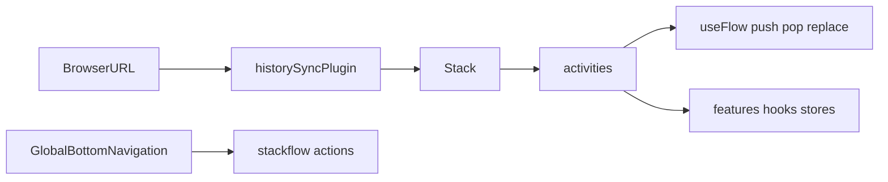

# Stackflow 팀 가이드

Brit은 **Next.js App Router가 아니라 Stackflow**로 화면 전환을 처리합니다.  
Activity = 한 화면(또는 한 URL) 단위 컴포넌트입니다.

공식 문서: https://stackflow.so/ko

## 개념

| 개념 | 설명 | 이 프로젝트 위치 |
|------|------|------------------|
| Activity | Stack에 쌓이는 화면 단위 | `src/activities/*.tsx` |
| Stack | Activity 스택 + 전환 애니메이션 | `src/stackflow/stackflow.ts` → `<Stack />` |
| config / Register | Activity 이름·route·params 타입 | `src/stackflow/config.ts` |
| `useFlow()` | Activity **내부**에서 push/pop/replace | 각 Activity, feature hook |
| `actions` | Stack **밖** 크롬에서 네비게이션 | `GlobalBottomNavigation`, `SignupCompleteActivity` |
| historySync | URL ↔ Stack 동기화 | `historySyncPlugin` in `stackflow.ts` |



## 파일 맵

| 파일 | 역할 |
|------|------|
| [`src/stackflow/config.ts`](../../src/stackflow/config.ts) | route 정의, `Register` params 타입 |
| [`src/stackflow/stackflow.ts`](../../src/stackflow/stackflow.ts) | Stack 생성, plugins, `components` 등록 |
| [`src/activities/`](../../src/activities/) | Activity 컴포넌트 |
| [`src/App.tsx`](../../src/App.tsx) | `<Stack initialContext={...} />` 마운트 |

## 화면 맵 (Activity ↔ route)

| Activity | Route | Params |
|----------|-------|--------|
| `Home` | `/` | — |
| `Detail` | `/detail/:id` | `id: string` |
| `Trade` | `/trade` | `tradeId?`, `splitGroupId?`, `focusLeg?` |
| `TradeCompose` | `/trade/compose` | `side: 'BUY' \| 'SELL'` |
| `SignupIdentity` | `/auth/signup/identity` | — |
| `SignupSms` | `/auth/signup/sms` | `phone: string` |
| `SignupAccount` | `/auth/signup/account` | `step?: SignupAccountStep` |
| `SignupPin` | `/auth/signup/pin` | `step?: SignupPinStep` |
| `SignupComplete` | `/auth/signup/complete` | — |
| `NotFound` | `/404` | — |

가입 플로우 상세: [docs/domains/auth.md](../domains/auth.md)

### Trade 라우트 예시

홈 퀵액션(구매/판매) → `push('TradeCompose', { side })` → 확인 후 `replace('Trade', params)`.

- 금액 입력: `/trade/compose?side=BUY` (또는 `SELL`)
- 분할 판매: `/trade?splitGroupId=split-xxx`
- 단건 거래: `/trade?tradeId=trade-xxx`
- leg 딥링크: `/trade?splitGroupId=split-xxx&focusLeg=2`

## Activity 내부 vs Stack 밖

### Activity 안 — `useFlow()`

```tsx
import { useFlow, useActivityParams } from '@stackflow/react'

const { push, pop, replace } = useFlow()
const { step } = useActivityParams<'SignupPin'>()

// 다음 화면
push('SignupSms', { phone: '01012345678' })

// 히스토리 정리 (PIN confirm → create 복귀)
replace('SignupPin', { step: 'create' })

// 뒤로
pop()
```

### Stack 밖 — `actions`

탭 바, 글로벌 배너 등 Activity 트리 밖에서 이동할 때:

```tsx
import { actions } from '../stackflow/stackflow'

actions.replace('Home', {}, { animate: false })
actions.push('SignupIdentity', {})
actions.pop(popCount, { animate: false })
```

예시:
- [`GlobalBottomNavigation.tsx`](../../src/app/layouts/GlobalBottomNavigation.tsx)
- [`SignupCompleteActivity.tsx`](../../src/activities/auth/SignupCompleteActivity.tsx)

## 새 Activity 추가 (5단계)

1. **`config.ts`** — `Register`에 Activity 이름·params 추가 + `activities` 배열에 `route`
2. **`src/activities/MyActivity.tsx`** — `ActivityComponentType<'MyActivity'>` 구현
3. **`stackflow.ts`** — `components: { MyActivity: MyActivity, ... }` 등록
4. **이동 코드** — `push('MyActivity', { ... })` (params는 Register와 일치)
5. **문서** — 이 파일의 화면 맵 + 필요 시 `docs/domains/*` 업데이트

## push / pop / replace 선택

| API | 사용 시점 |
|-----|-----------|
| `push` | 새 화면을 스택에 쌓음 (일반 forward) |
| `pop` | 이전 Activity로 (뒤로가기) |
| `replace` | 현재 Activity를 교체 (히스토리에 남기지 않음) — PIN confirm, 탭 전환, 가입 완료 후 Home |

## Activity vs BottomSheet

| 전체 화면 | 맥락 내 오버레이 |
|-----------|------------------|
| Activity (`push`) | BottomSheet / AlertDialog |
| URL 공유·딥링크 필요 | 같은 Activity 안 흐름 |

Consumer UX: **진입 직후** 전면 BottomSheet 금지. 거래 맥락 내 시트만.

## Activity 작성 패턴 (권장)

```tsx
/**
 * MyActivity — 화면 조립만.
 * @see docs/stackflow/README.md
 */
const MyActivity: ActivityComponentType<'MyActivity'> = () => {
  const screen = useMyScreen() // features/*/hooks/
  return <MyScreenLayout {...screen} />
}
```

- orchestration·effect는 `useMyScreen` hook으로
- 목표: Activity **80~120줄** (JSX 위주)
- 참고: [`HomeActivity`](../../src/activities/HomeActivity.tsx) + [`useHomeScreen`](../../src/features/home/hooks/useHomeScreen.ts)

## `useActivity` / `isActive`

백그라운드 Activity에서 effect가 돌지 않게 할 때:

```tsx
const { isActive } = useActivity()
useEffect(() => {
  if (!isActive) return
  // ...
}, [isActive])
```

## 안티패턴

- Activity 200줄+ 에 effect·handler·store 호출 혼재
- `window.location` / `history.pushState` 직접 조작 (`useFlow` / `actions` 사용)
- URL params와 store 상태 불일치 (`Register` 타입 미갱신)
- Activity마다 다른 네비 패턴 (팀 레시피 통일)

## 관련 문서

- [docs/architecture/overview.md](../architecture/overview.md)
- [docs/adr/001-stackflow-navigation.md](../adr/001-stackflow-navigation.md)
- [docs/domains/trade.md](../domains/trade.md)
